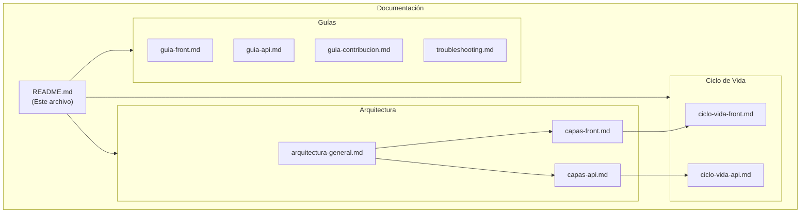

# Documentación del Framework de Automatización

Bienvenido a la documentación técnica del framework de automatización con Playwright, Cucumber y TypeScript.

## Índice de Documentación

### Arquitectura

| Documento | Descripción |
|-----------|-------------|
| [Arquitectura General](./arquitectura-general.md) | Visión global del framework, módulos y sus relaciones |
| [Capas del Módulo Front](./capas-front.md) | Detalle de cada capa del módulo de UI (POM + Cucumber) |
| [Capas del Módulo API](./capas-api.md) | Detalle de cada capa del módulo de API (Service Model) |

### Ciclo de Vida

| Documento | Descripción |
|-----------|-------------|
| [Ciclo de Vida Front](./ciclo-vida-front.md) | Flujo completo del browser/driver desde inicio hasta cierre |
| [Ciclo de Vida API](./ciclo-vida-api.md) | Flujo del cliente HTTP desde inicialización hasta dispose |

### Guías Prácticas

| Documento | Descripción |
|-----------|-------------|
| [Guía del Módulo Front](./guia-front.md) | Cómo trabajar con el módulo de UI |
| [Guía del Módulo API](./guia-api.md) | Cómo trabajar con el módulo de API |
| [Guía de Contribución](./guia-contribucion.md) | Cómo añadir páginas, servicios, tests y features |
| [Troubleshooting](./troubleshooting.md) | Problemas comunes y sus soluciones |

## Diagrama de Navegación

## Convenciones de la Documentación

- **Diagramas**: Utilizamos [Mermaid](https://mermaid.js.org/) para diagramas renderizables en GitHub/GitLab
- **Idioma**: Documentación en español
- **Código**: Ejemplos en TypeScript con sintaxis resaltada
- **Referencias**: Links relativos entre documentos

## Inicio Rápido

Si eres nuevo en el proyecto, te recomendamos leer en este orden:

1. [Arquitectura General](./arquitectura-general.md) - Entender la estructura global
2. [Ciclo de Vida Front](./ciclo-vida-front.md) o [Ciclo de Vida API](./ciclo-vida-api.md) - Según el módulo que vayas a usar
3. [Guía de Contribución](./guia-contribucion.md) - Para empezar a añadir tests
