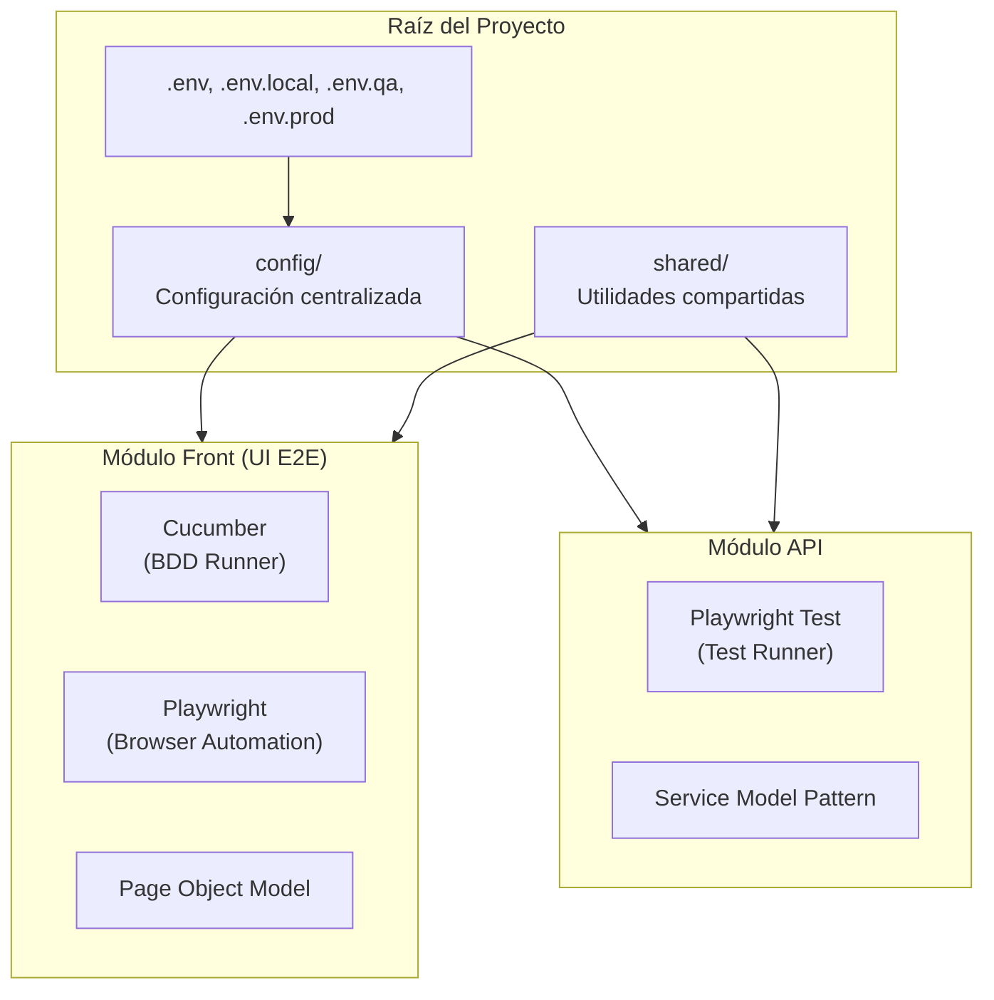
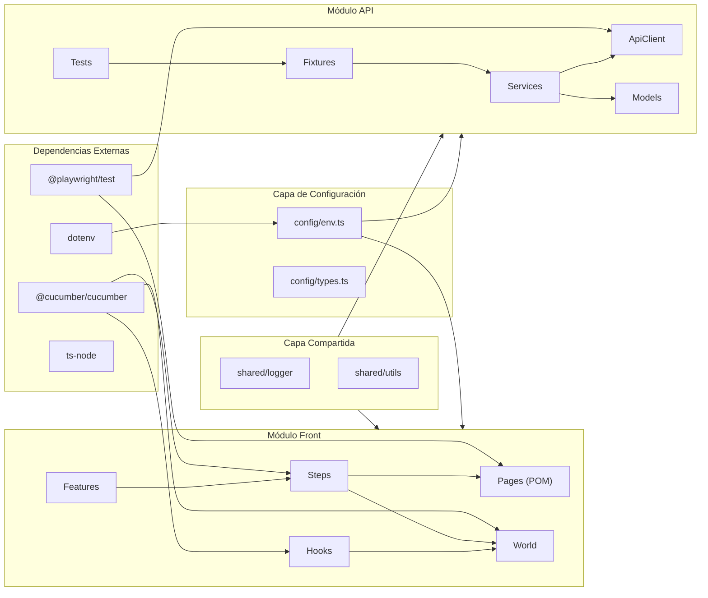
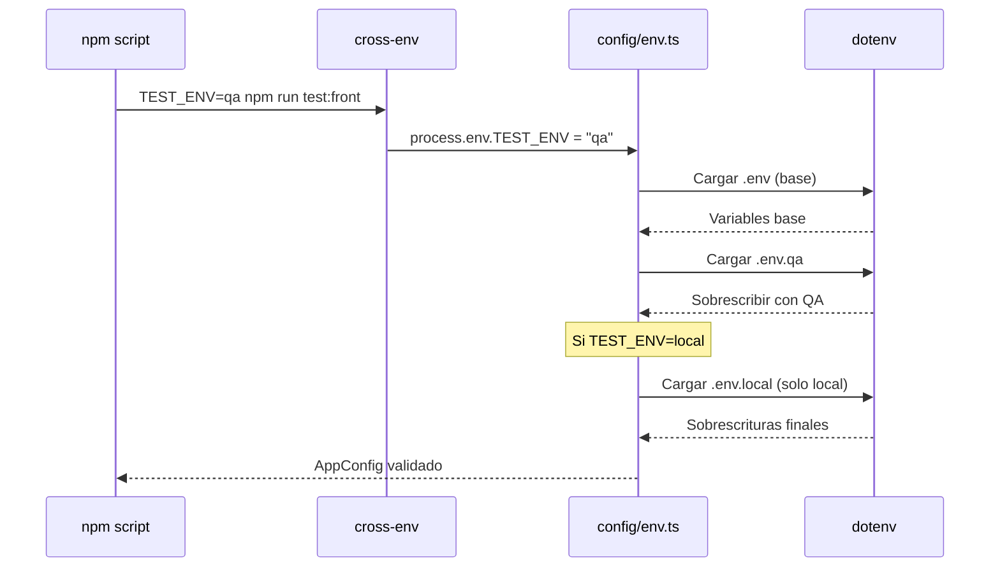

# Arquitectura General del Framework

## Visión Global

Este framework implementa automatización de pruebas con dos módulos independientes que comparten configuración y utilidades comunes.



## Estructura de Directorios

```
automation-playwright/
├── config/                    # Configuración centralizada
│   ├── env.ts                 # Carga y valida variables de entorno
│   ├── types.ts               # Tipos de configuración
│   └── index.ts               # Exporta config
├── shared/                    # Código compartido entre módulos
│   ├── logger/                # Utilidad de logging
│   ├── types/                 # Tipos comunes
│   └── utils/                 # Helpers (dataFactory, wait)
├── front/                     # Módulo UI E2E
│   ├── cucumber.js            # Configuración Cucumber
│   ├── playwright.config.ts   # Config Playwright para screenshots/traces
│   ├── tsconfig.json          # Config TypeScript del módulo
│   └── src/
│       ├── features/          # Archivos .feature (Gherkin)
│       ├── steps/             # Implementación de steps
│       ├── pages/             # Page Objects
│       ├── hooks/             # BeforeAll, Before, After, AfterAll
│       ├── support/           # World y contexto de test
│       ├── fixtures/          # Fixtures adicionales
│       └── data/              # Datos de prueba (JSON)
├── api/                       # Módulo API
│   ├── playwright.config.ts   # Configuración Playwright Test
│   ├── tsconfig.json          # Config TypeScript del módulo
│   └── src/
│       ├── tests/             # Specs de prueba
│       ├── services/          # Servicios por dominio
│       ├── client/            # Cliente HTTP base
│       ├── models/            # Request/Response types
│       ├── fixtures/          # Playwright fixtures
│       └── hooks/             # Hooks de test
├── reports/                   # Reportes generados
│   ├── front/                 # Reportes Cucumber + screenshots
│   └── api/                   # Reportes Playwright Test
├── .env                       # Variables base
├── .env.local                 # Sobrescrituras locales
├── .env.qa                    # Config ambiente QA
├── .env.prod                  # Config ambiente Producción
└── package.json               # Scripts y dependencias
```

## Comparativa de Módulos

| Aspecto | Módulo Front | Módulo API |
|---------|--------------|------------|
| **Runner** | Cucumber | Playwright Test |
| **Sintaxis de Test** | Gherkin (.feature) | TypeScript (.spec.ts) |
| **Patrón Principal** | Page Object Model | Service Model |
| **Driver/Cliente** | Browser (Chromium) | APIRequestContext |
| **Ciclo de Vida** | Hooks Cucumber | Fixtures Playwright |
| **Objetivo** | UI E2E Testing | API Functional Testing |

## Diagrama de Dependencias



## Flujo de Configuración de Entorno

La configuración se carga en capas, permitiendo sobrescrituras por ambiente:



## Principios de Diseño

### 1. Separación de Responsabilidades

Cada capa tiene una responsabilidad única:
- **Config**: Gestión de entornos y variables
- **Pages/Services**: Encapsulación de interacciones
- **Steps/Tests**: Orquestación de flujos
- **Features/Specs**: Definición de comportamiento

### 2. Reutilización

- `BasePage` y `BaseService` proveen funcionalidad común
- `shared/` contiene código agnóstico al módulo
- Fixtures y World evitan duplicación de setup/teardown

### 3. Tipado Fuerte

- Modelos TypeScript para requests/responses
- Interfaces para configuración
- Tipos genéricos en World y Services

### 4. Independencia de Módulos

- Front y API pueden ejecutarse independientemente
- No hay dependencias cruzadas entre módulos
- Comparten solo configuración y utilidades

## Próximos Pasos

- [Capas del Módulo Front](./capas-front.md) - Detalle de cada capa UI
- [Capas del Módulo API](./capas-api.md) - Detalle de cada capa API
- [Ciclo de Vida Front](./ciclo-vida-front.md) - Flujo del browser
- [Ciclo de Vida API](./ciclo-vida-api.md) - Flujo del cliente HTTP
