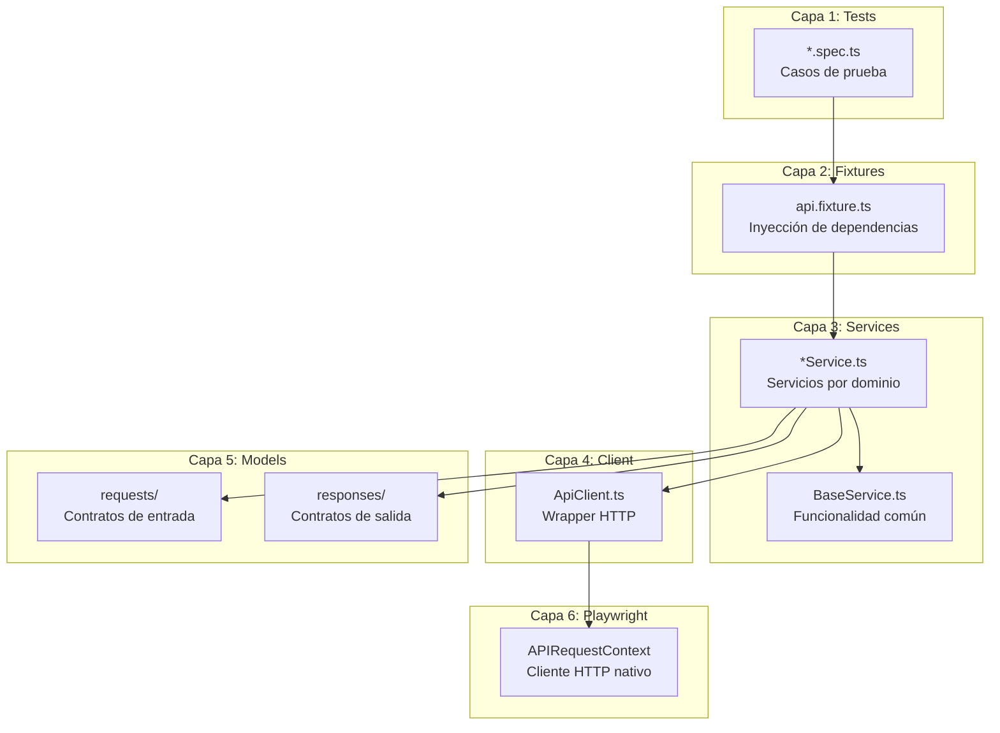
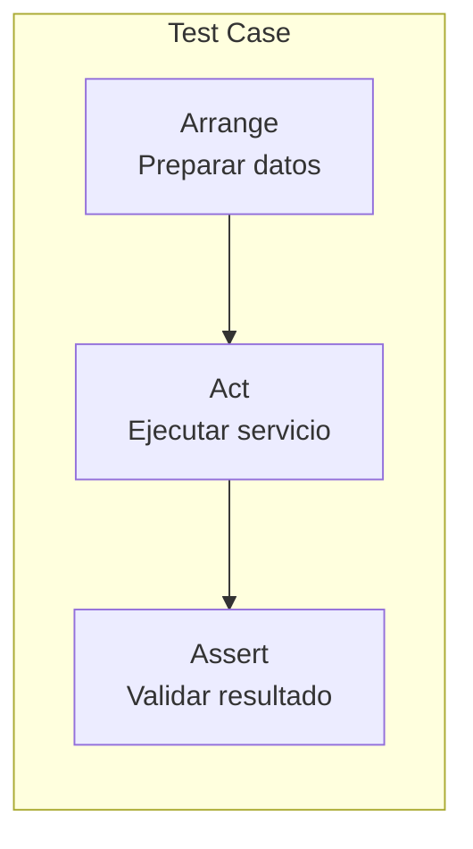
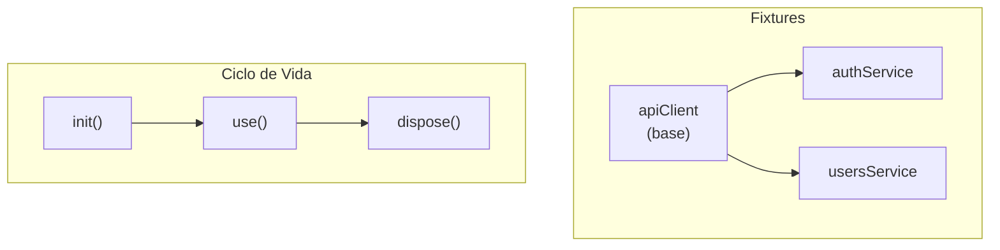
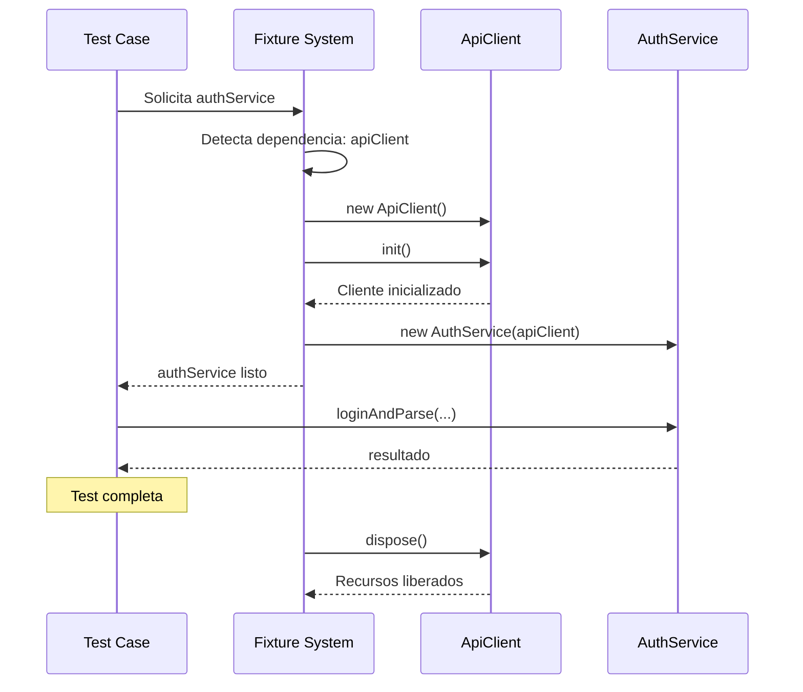
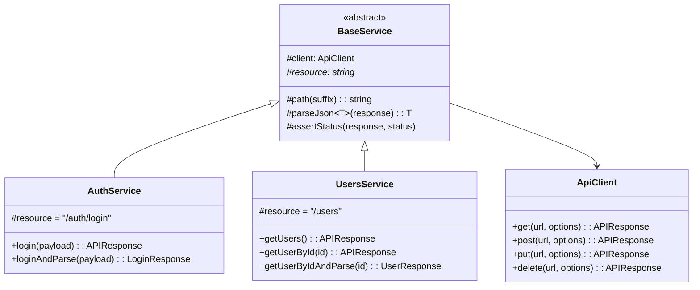
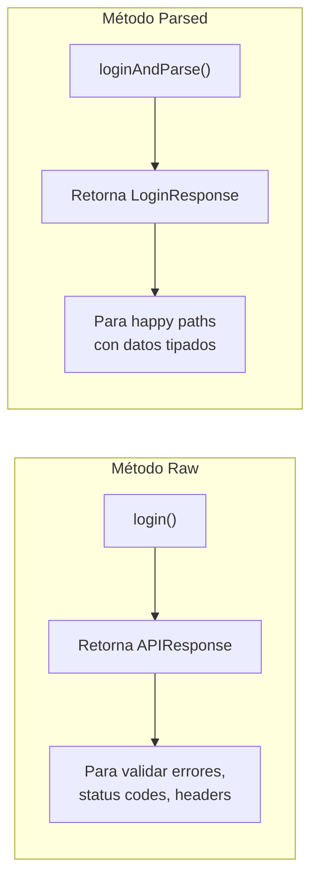
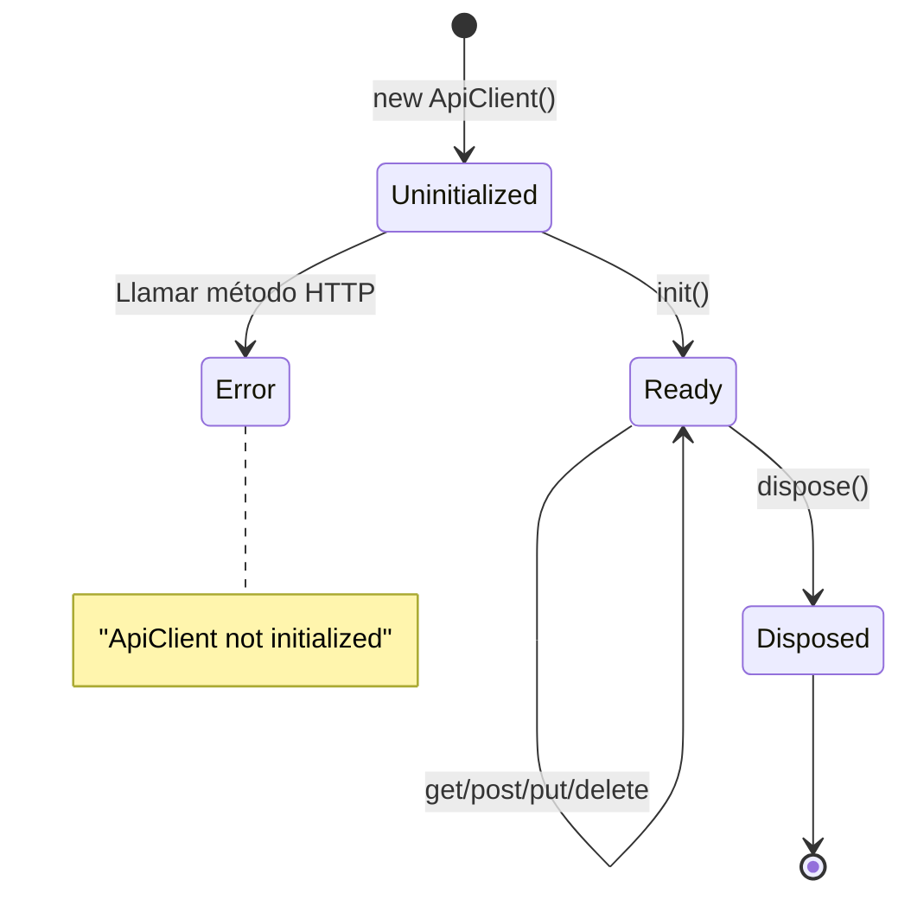
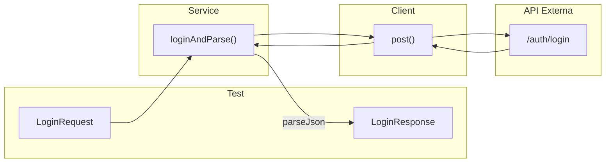
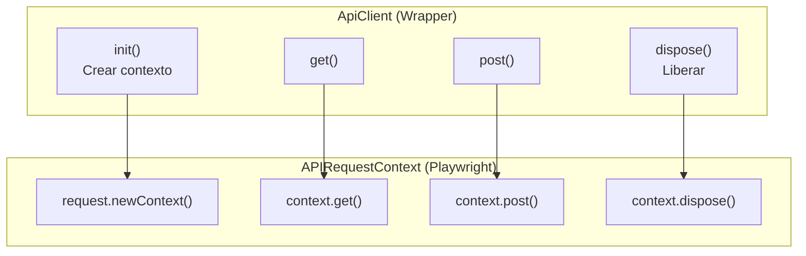
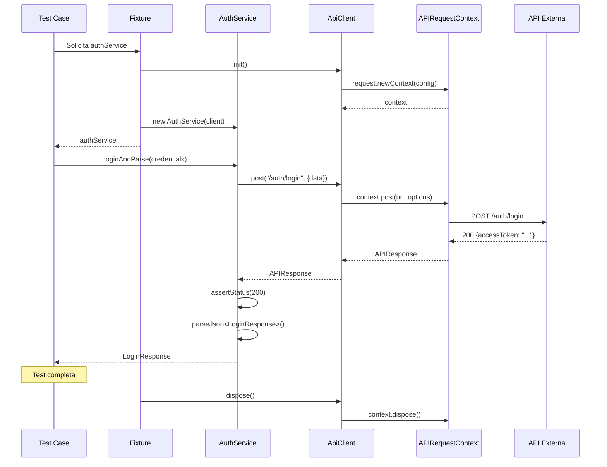

# Capas del Módulo API

El módulo API implementa pruebas funcionales de servicios HTTP utilizando Playwright Test con el patrón Service Model.

## Diagrama de Capas



## Capa 1: Tests

**Ubicación**: `api/src/tests/`

### Propósito

Definir casos de prueba que validan el comportamiento de los endpoints API. Los tests no realizan llamadas HTTP directas, sino que consumen servicios.

### Anatomía de un Test File

```typescript
// api/src/tests/auth.spec.ts
import { config } from "../../../config";
import { expect, test } from "../fixtures/api.fixture";

test.describe("Auth service", () => {

  test("should login with valid credentials", async ({ authService }) => {
    // Arrange: preparar datos (desde config)
    const credentials = {
      username: config.e2eUsername,
      password: config.e2ePassword
    };

    // Act: ejecutar acción via servicio
    const body = await authService.loginAndParse(credentials);

    // Assert: validar resultado
    expect(body.accessToken).toBeTruthy();
  });

  test("should fail login with invalid credentials", async ({ authService }) => {
    // Act: ejecutar con datos inválidos
    const response = await authService.login({
      username: "invalid-user",
      password: "wrong-password"
    });

    // Assert: validar status de error
    expect([400, 401]).toContain(response.status());
  });

});
```

### Patrón AAA (Arrange-Act-Assert)



### Reglas de Diseño

| Hacer | No Hacer |
|-------|----------|
| Importar `test` y `expect` desde fixture | Importar directamente de `@playwright/test` |
| Usar servicios para llamadas HTTP | Usar `request.get()` directamente |
| Agrupar tests relacionados en `describe` | Tests sueltos sin agrupación |
| Nombres descriptivos del comportamiento | Nombres técnicos (`test1`, `testEndpoint`) |

---

## Capa 2: Fixtures

**Ubicación**: `api/src/fixtures/`

### Propósito

Proveer inyección de dependencias para los tests. Centraliza la creación y destrucción de instancias reutilizables.

### api.fixture.ts

```typescript
// api/src/fixtures/api.fixture.ts
import { test as base } from "@playwright/test";
import { ApiClient } from "../client/ApiClient";
import { AuthService } from "../services/AuthService";
import { UsersService } from "../services/UsersService";
import "../hooks/api.hooks";

// Definir tipos de fixtures disponibles
type ApiFixtures = {
  apiClient: ApiClient;
  authService: AuthService;
  usersService: UsersService;
};

// Extender test base con nuestros fixtures
export const test = base.extend<ApiFixtures>({

  // Fixture del cliente API
  apiClient: async ({}, use) => {
    const client = new ApiClient();
    await client.init();      // Setup: inicializar contexto HTTP
    await use(client);        // Proveer al test
    await client.dispose();   // Teardown: liberar recursos
  },

  // Fixture de AuthService (depende de apiClient)
  authService: async ({ apiClient }, use) => {
    await use(new AuthService(apiClient));
  },

  // Fixture de UsersService (depende de apiClient)
  usersService: async ({ apiClient }, use) => {
    await use(new UsersService(apiClient));
  }

});

// Re-exportar expect para uso en tests
export { expect } from "@playwright/test";
```

### Diagrama de Dependencias de Fixtures



### Flujo de Ejecución de Fixture



---

## Capa 3: Services (Service Model)

**Ubicación**: `api/src/services/`

### Propósito

Encapsular la lógica de interacción con endpoints API. Cada servicio representa un dominio o recurso del API.

### BaseService: Clase Base

```typescript
// api/src/services/BaseService.ts
import { APIResponse, expect } from "@playwright/test";
import { ApiClient } from "../client/ApiClient";

export abstract class BaseService {
  protected readonly client: ApiClient;

  // Cada servicio define su recurso base
  protected abstract readonly resource: string;

  constructor(client: ApiClient) {
    this.client = client;
  }

  // Construir path del endpoint
  protected path(suffix = ""): string {
    return `${this.resource}${suffix}`;
  }

  // Parsear respuesta a tipo específico
  protected async parseJson<T>(response: APIResponse): Promise<T> {
    const body = (await response.json()) as T;
    return body;
  }

  // Validar status esperado
  protected assertStatus(response: APIResponse, expectedStatus: number): void {
    expect(
      response.status(),
      `Expected status ${expectedStatus} but got ${response.status()}`
    ).toBe(expectedStatus);
  }
}
```

### Service Concreto: AuthService

```typescript
// api/src/services/AuthService.ts
import { APIResponse } from "@playwright/test";
import { LoginRequest } from "../models/requests/LoginRequest";
import { LoginResponse } from "../models/responses/LoginResponse";
import { BaseService } from "./BaseService";

export class AuthService extends BaseService {
  // Recurso base para este servicio
  protected readonly resource = "/auth/login";

  // Método que retorna respuesta raw (para validar status manualmente)
  async login(payload: LoginRequest): Promise<APIResponse> {
    return this.client.post(this.path(), { data: payload });
  }

  // Método que parsea y valida (happy path)
  async loginAndParse(payload: LoginRequest): Promise<LoginResponse> {
    const response = await this.login(payload);
    this.assertStatus(response, 200);
    return this.parseJson<LoginResponse>(response);
  }
}
```

### Service Concreto: UsersService

```typescript
// api/src/services/UsersService.ts
import { APIResponse } from "@playwright/test";
import { UserResponse } from "../models/responses/UserResponse";
import { BaseService } from "./BaseService";

export class UsersService extends BaseService {
  protected readonly resource = "/users";

  async getUsers(): Promise<APIResponse> {
    return this.client.get(this.path());
  }

  async getUserById(id: number): Promise<APIResponse> {
    return this.client.get(this.path(`/${id}`));
  }

  async getUserByIdAndParse(id: number): Promise<UserResponse> {
    const response = await this.getUserById(id);
    this.assertStatus(response, 200);
    return this.parseJson<UserResponse>(response);
  }
}
```

### Diagrama de Clases



### Patrón de Métodos Duales

Cada operación suele tener dos variantes:



---

## Capa 4: Client

**Ubicación**: `api/src/client/`

### Propósito

Wrapper sobre `APIRequestContext` de Playwright. Centraliza configuración HTTP común (baseURL, headers, timeout).

### ApiClient.ts

```typescript
// api/src/client/ApiClient.ts
import { APIRequestContext, APIResponse, request } from "@playwright/test";
import { config } from "../../../config";

export interface RequestOptions {
  headers?: Record<string, string>;
  query?: Record<string, string | number | boolean>;
  data?: unknown;
}

export class ApiClient {
  private context?: APIRequestContext;

  // Inicializar contexto HTTP
  async init(): Promise<void> {
    this.context = await request.newContext({
      baseURL: config.apiBaseUrl,
      timeout: config.apiTimeout,
      extraHTTPHeaders: {
        Accept: "application/json",
        ...(config.apiToken ? { Authorization: `Bearer ${config.apiToken}` } : {})
      }
    });
  }

  // Liberar recursos
  async dispose(): Promise<void> {
    await this.context?.dispose();
  }

  // Validar que el contexto está inicializado
  private ensureContext(): APIRequestContext {
    if (!this.context) {
      throw new Error("ApiClient not initialized. Call init() first.");
    }
    return this.context;
  }

  // Métodos HTTP
  async get(url: string, options?: RequestOptions): Promise<APIResponse> {
    return this.ensureContext().get(url, {
      headers: options?.headers,
      params: options?.query
    });
  }

  async post(url: string, options?: RequestOptions): Promise<APIResponse> {
    return this.ensureContext().post(url, {
      headers: options?.headers,
      params: options?.query,
      data: options?.data
    });
  }

  async put(url: string, options?: RequestOptions): Promise<APIResponse> {
    return this.ensureContext().put(url, {
      headers: options?.headers,
      params: options?.query,
      data: options?.data
    });
  }

  async delete(url: string, options?: RequestOptions): Promise<APIResponse> {
    return this.ensureContext().delete(url, {
      headers: options?.headers,
      params: options?.query,
      data: options?.data
    });
  }
}
```

### Estados del Cliente



---

## Capa 5: Models

**Ubicación**: `api/src/models/`

### Propósito

Definir contratos TypeScript para requests y responses, asegurando tipado fuerte en toda la cadena.

### Estructura

```
api/src/models/
├── requests/
│   └── LoginRequest.ts
└── responses/
    ├── LoginResponse.ts
    └── UserResponse.ts
```

### Ejemplo de Request Model

```typescript
// api/src/models/requests/LoginRequest.ts
export interface LoginRequest {
  username: string;
  password: string;
}
```

### Ejemplo de Response Model

```typescript
// api/src/models/responses/LoginResponse.ts
export interface LoginResponse {
  accessToken: string;
  refreshToken?: string;
  expiresIn: number;
  tokenType: string;
}

// api/src/models/responses/UserResponse.ts
export interface UserResponse {
  id: number;
  username: string;
  email: string;
  firstName: string;
  lastName: string;
}
```

### Flujo de Tipos



---

## Capa 6: Playwright (APIRequestContext)

### Propósito

Proveer el cliente HTTP nativo. Esta capa es proporcionada por Playwright y es consumida por `ApiClient`.

### Características

- **Gestión de conexiones**: Pool de conexiones HTTP
- **Timeouts**: Configurables por request
- **Headers**: Aplicados globalmente o por request
- **Serialización**: JSON automático para body
- **Cookies**: Manejo automático de sesión

### Relación con ApiClient



---

## Flujo Completo de una Petición



## Próximos Pasos

- [Ciclo de Vida API](./ciclo-vida-api.md) - Diagrama temporal detallado
- [Guía de Contribución](./guia-contribucion.md) - Cómo añadir servicios y tests
