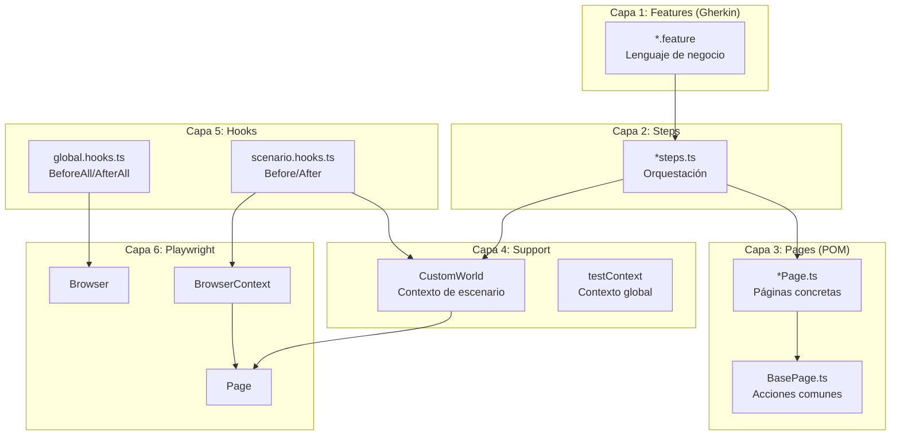
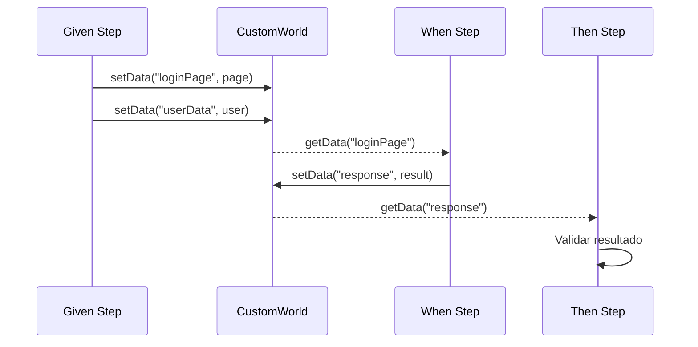
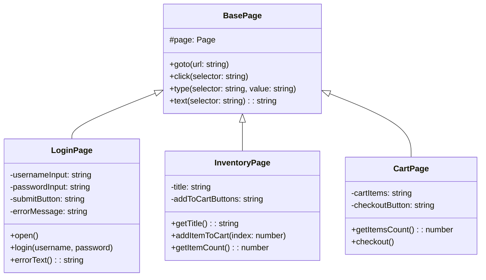
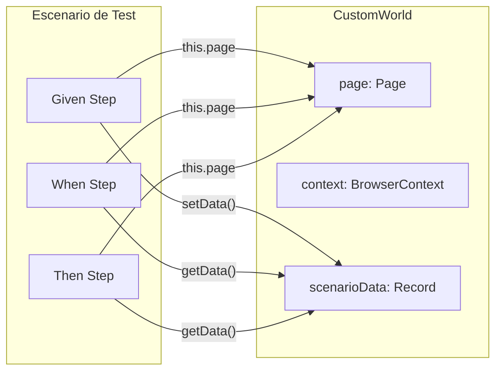
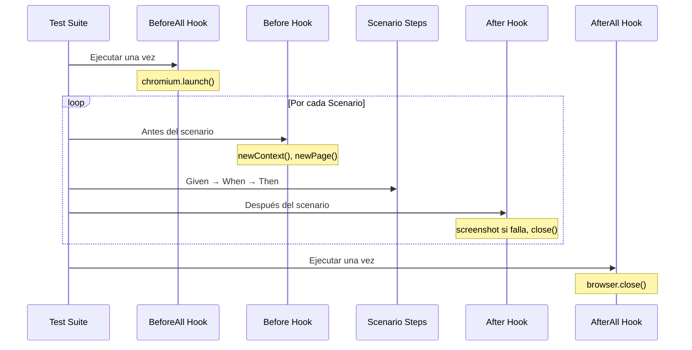
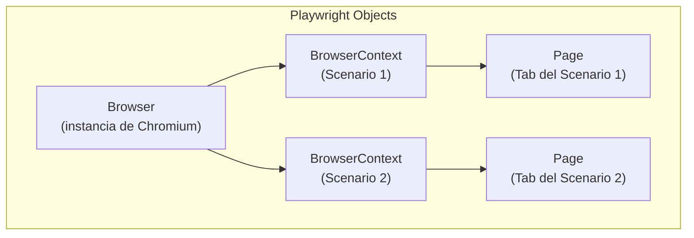
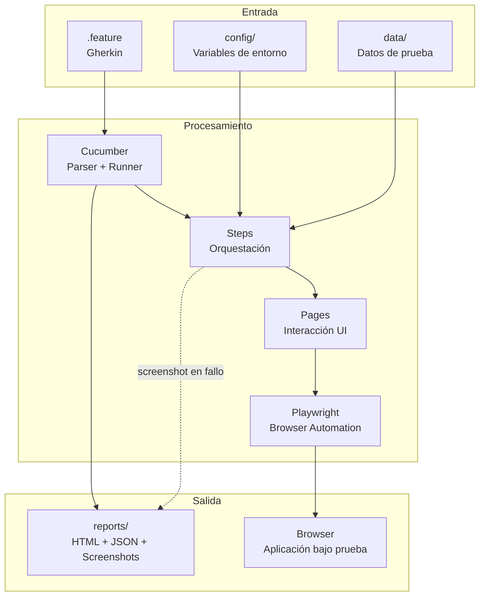

# Capas del Módulo Front

El módulo Front implementa pruebas E2E de interfaz de usuario utilizando Cucumber (BDD) con Playwright y el patrón Page Object Model (POM).

## Diagrama de Capas



## Capa 1: Features (Gherkin)

**Ubicación**: `front/src/features/`

### Propósito

Definir el comportamiento esperado en lenguaje natural, comprensible para stakeholders no técnicos.

### Estructura de un Feature

```gherkin
# front/src/features/login.feature
Feature: Login de usuario
  Como usuario del sistema
  Quiero poder iniciar sesión
  Para acceder a las funcionalidades

  Scenario: Login exitoso con credenciales válidas
    Given el usuario está en la página de login
    When ingresa credenciales válidas
    And hace clic en el botón de login
    Then debe ver la página de inventario

  Scenario: Login fallido con credenciales inválidas
    Given el usuario está en la página de login
    When ingresa credenciales inválidas
    And hace clic en el botón de login
    Then debe ver un mensaje de error
```

### Reglas de Diseño

| Hacer | No Hacer |
|-------|----------|
| Usar lenguaje de negocio | Mencionar selectores CSS |
| Describir intención del usuario | Incluir detalles técnicos |
| Mantener escenarios independientes | Crear dependencias entre scenarios |
| Usar Background para setup común | Repetir Given en cada scenario |

### Elementos Gherkin Soportados

- `Feature`: Agrupa escenarios relacionados
- `Scenario`: Caso de prueba individual
- `Scenario Outline` + `Examples`: Pruebas parametrizadas
- `Background`: Steps comunes previos a cada scenario
- `Given/When/Then/And/But`: Steps del escenario

---

## Capa 2: Steps

**Ubicación**: `front/src/steps/`

### Propósito

Implementar los steps de Gherkin, orquestando llamadas a Page Objects sin contener lógica de UI directa.

### Anatomía de un Step File

```typescript
// front/src/steps/login.steps.ts
import { Given, When, Then } from "@cucumber/cucumber";
import { expect } from "@playwright/test";
import { CustomWorld } from "../support/world";
import { LoginPage } from "../pages/LoginPage";
import { InventoryPage } from "../pages/InventoryPage";
import { config } from "../../../config";

Given("el usuario está en la página de login", async function (this: CustomWorld) {
  // Crear instancia de Page Object con la página del World
  const loginPage = new LoginPage(this.page!);

  // Delegar acción al Page Object
  await loginPage.open();

  // Opcional: guardar referencia para steps posteriores
  this.setData("loginPage", loginPage);
});

When("ingresa credenciales válidas", async function (this: CustomWorld) {
  const loginPage = this.getData<LoginPage>("loginPage")!;

  // Usar configuración centralizada, no hardcodear credenciales
  await loginPage.login(config.frontUsername, config.frontPassword);
});

Then("debe ver la página de inventario", async function (this: CustomWorld) {
  const inventoryPage = new InventoryPage(this.page!);

  // Validación usando expect de Playwright
  const title = await inventoryPage.getTitle();
  expect(title).toContain("Products");
});
```

### Patrón de Comunicación entre Steps



### Reglas de Diseño

| Hacer | No Hacer |
|-------|----------|
| Delegar UI a Page Objects | Usar `this.page.locator()` directamente |
| Usar `this.setData()/getData()` para compartir estado | Usar variables globales |
| Tipar `this: CustomWorld` | Omitir el tipo de this |
| Importar config para valores | Hardcodear URLs/credenciales |

---

## Capa 3: Pages (Page Object Model)

**Ubicación**: `front/src/pages/`

### Propósito

Encapsular la interacción con la UI: selectores, acciones y validaciones específicas de cada página.

### BasePage: Clase Base

```typescript
// front/src/pages/BasePage.ts
import { Page } from "playwright";

export class BasePage {
  protected readonly page: Page;

  constructor(page: Page) {
    this.page = page;
  }

  // Navegación
  async goto(url: string): Promise<void> {
    await this.page.goto(url, { waitUntil: "domcontentloaded" });
  }

  // Acciones genéricas
  async click(selector: string): Promise<void> {
    await this.page.locator(selector).click();
  }

  async type(selector: string, value: string): Promise<void> {
    await this.page.locator(selector).fill(value);
  }

  async text(selector: string): Promise<string> {
    return (await this.page.locator(selector).textContent()) ?? "";
  }
}
```

### Page Concreta: Ejemplo LoginPage

```typescript
// front/src/pages/LoginPage.ts
import { config } from "../../../config";
import { BasePage } from "./BasePage";

export class LoginPage extends BasePage {
  // Selectores como propiedades privadas
  private readonly usernameInput = "#user-name";
  private readonly passwordInput = "#password";
  private readonly submitButton = "#login-button";
  private readonly errorMessage = "[data-test='error']";

  // Métodos de acción
  async open(): Promise<void> {
    await this.goto(config.frontBaseUrl);
  }

  async login(username: string, password: string): Promise<void> {
    await this.type(this.usernameInput, username);
    await this.type(this.passwordInput, password);
    await this.click(this.submitButton);
  }

  // Métodos de obtención de datos
  async errorText(): Promise<string> {
    return this.text(this.errorMessage);
  }
}
```

### Diagrama de Herencia



### Reglas de Diseño

| Hacer | No Hacer |
|-------|----------|
| Selectores como propiedades privadas | Exponer selectores públicamente |
| Métodos con nombres de acción de negocio | Métodos genéricos como `clickButton1()` |
| Retornar datos tipados | Retornar elementos de Playwright |
| Heredar de BasePage | Duplicar lógica común |

---

## Capa 4: Support

**Ubicación**: `front/src/support/`

### Propósito

Proveer contexto compartido para los escenarios: referencias a browser/page y almacenamiento de datos entre steps.

### CustomWorld

```typescript
// front/src/support/world.ts
import { IWorldOptions, setWorldConstructor, World } from "@cucumber/cucumber";
import { Browser, BrowserContext, Page } from "playwright";

export class CustomWorld extends World {
  // Referencias de Playwright (inicializadas por hooks)
  browser?: Browser;
  context?: BrowserContext;
  page?: Page;

  // Store de datos por escenario
  private scenarioData: Record<string, unknown> = {};

  constructor(options: IWorldOptions) {
    super(options);
  }

  // Guardar dato para uso posterior en el escenario
  setData<T>(key: string, value: T): void {
    this.scenarioData[key] = value as unknown;
  }

  // Recuperar dato guardado
  getData<T>(key: string): T | undefined {
    return this.scenarioData[key] as T | undefined;
  }

  // Limpiar datos (llamado en Before hook)
  clearData(): void {
    this.scenarioData = {};
  }
}

setWorldConstructor(CustomWorld);
```

### testContext (Contexto Global)

```typescript
// front/src/support/testContext.ts
import { Browser } from "playwright";

// Singleton para mantener referencia al browser entre scenarios
export const uiContext: { browser?: Browser } = {};
```

### Diagrama de Uso del World



---

## Capa 5: Hooks

**Ubicación**: `front/src/hooks/`

### Propósito

Gestionar el ciclo de vida del browser, contexto y página, además de tareas transversales como capturas de pantalla.

### global.hooks.ts (Ciclo de Suite)

```typescript
// front/src/hooks/global.hooks.ts
import { config } from "../../../config";
import { AfterAll, BeforeAll } from "@cucumber/cucumber";
import { chromium } from "playwright";
import { uiContext } from "../support/testContext";

BeforeAll(async () => {
  // Lanza browser una vez para toda la suite
  uiContext.browser = await chromium.launch({
    headless: config.frontHeadless,
    slowMo: config.frontSlowMoMs
  });
});

AfterAll(async () => {
  // Cierra browser al finalizar la suite
  await uiContext.browser?.close();
});
```

### scenario.hooks.ts (Ciclo de Escenario)

```typescript
// front/src/hooks/scenario.hooks.ts
import { After, Before, ITestCaseHookParameter, Status } from "@cucumber/cucumber";
import fs from "node:fs";
import path from "node:path";
import { CustomWorld } from "../support/world";
import { uiContext } from "../support/testContext";

Before(async function (this: CustomWorld) {
  if (!uiContext.browser) {
    throw new Error("Browser is not initialized.");
  }

  // Limpiar datos del escenario anterior
  this.clearData();

  // Crear nuevo contexto y página para aislamiento
  this.context = await uiContext.browser.newContext();
  this.page = await this.context.newPage();
});

After(async function (this: CustomWorld, scenario: ITestCaseHookParameter) {
  // Capturar screenshot si el escenario falló
  if (this.page && scenario.result?.status === Status.FAILED) {
    const reportDir = path.resolve(process.cwd(), "reports/front/screenshots");
    fs.mkdirSync(reportDir, { recursive: true });

    const fileName = `${scenario.pickle.name.replace(/\s+/g, "_")}-${Date.now()}.png`;
    await this.page.screenshot({
      path: path.join(reportDir, fileName),
      fullPage: true
    });
  }

  // Cerrar contexto (libera recursos)
  await this.context?.close();
});
```

### Orden de Ejecución de Hooks



---

## Capa 6: Playwright (Driver)

### Propósito

Automatizar el browser. Esta capa es proporcionada por Playwright y es consumida por las capas superiores.

### Jerarquía de Objetos



### Responsabilidades por Objeto

| Objeto | Responsabilidad | Ciclo de Vida |
|--------|-----------------|---------------|
| **Browser** | Instancia del navegador | Suite completa |
| **BrowserContext** | Sesión aislada (cookies, storage) | Por escenario |
| **Page** | Tab del navegador | Por escenario |

---

## Flujo Completo de Datos



## Próximos Pasos

- [Ciclo de Vida Front](./ciclo-vida-front.md) - Diagrama temporal detallado
- [Guía de Contribución](./guia-contribucion.md) - Cómo añadir páginas y features
