# Ciclo de Vida del Cliente HTTP - Módulo API

Este documento detalla el ciclo de vida completo del cliente HTTP en el módulo API, desde la inicialización del contexto hasta la liberación de recursos.

## Visión General

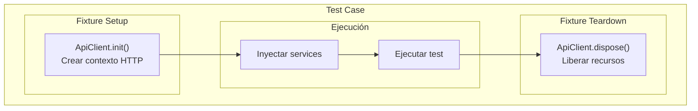

## Diagrama de Secuencia Completo

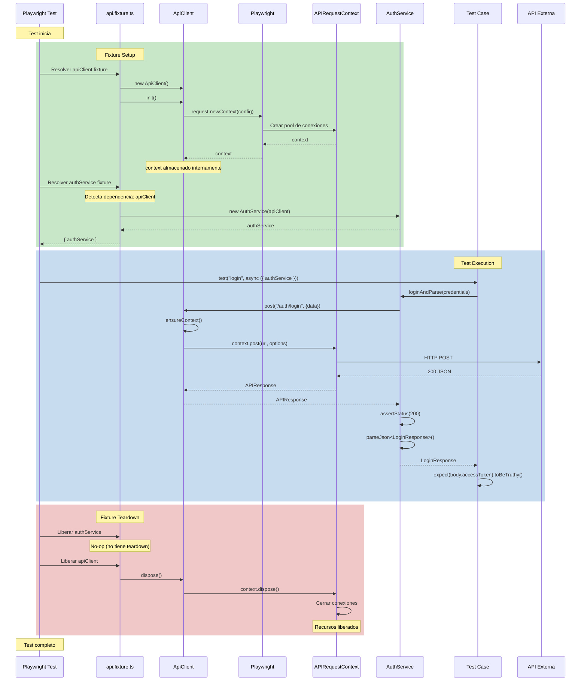

## Fases del Ciclo de Vida

### Fase 1: Creación del ApiClient

**Archivo**: `api/src/fixtures/api.fixture.ts`

**Cuándo**: Cuando un test solicita un fixture que depende de `apiClient`.

**Qué hace**:
1. Crea instancia de ApiClient
2. Llama a `init()` para crear el contexto HTTP
3. Provee el cliente al test

```typescript
apiClient: async ({}, use) => {
  const client = new ApiClient();
  await client.init();      // Setup
  await use(client);        // Proveer al test
  await client.dispose();   // Teardown
}
```

**Diagrama de estados del ApiClient**:

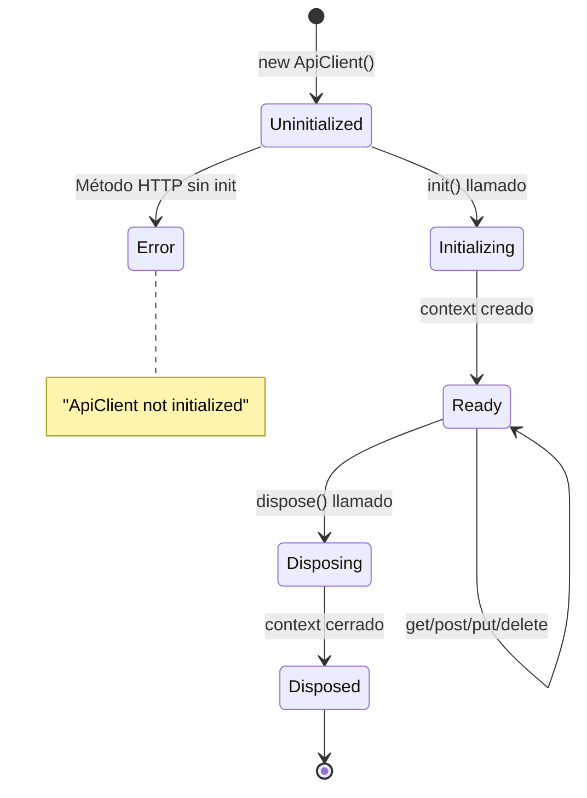

---

### Fase 2: Inicialización del Contexto HTTP

**Archivo**: `api/src/client/ApiClient.ts`

**Cuándo**: Durante `client.init()`.

**Qué hace**:
1. Lee configuración (baseURL, timeout, token)
2. Crea `APIRequestContext` con headers comunes
3. Almacena referencia internamente

```typescript
async init(): Promise<void> {
  this.context = await request.newContext({
    baseURL: config.apiBaseUrl,
    timeout: config.apiTimeout,
    extraHTTPHeaders: {
      Accept: "application/json",
      ...(config.apiToken ? { Authorization: `Bearer ${config.apiToken}` } : {})
    }
  });
}
```

**Configuración aplicada**:

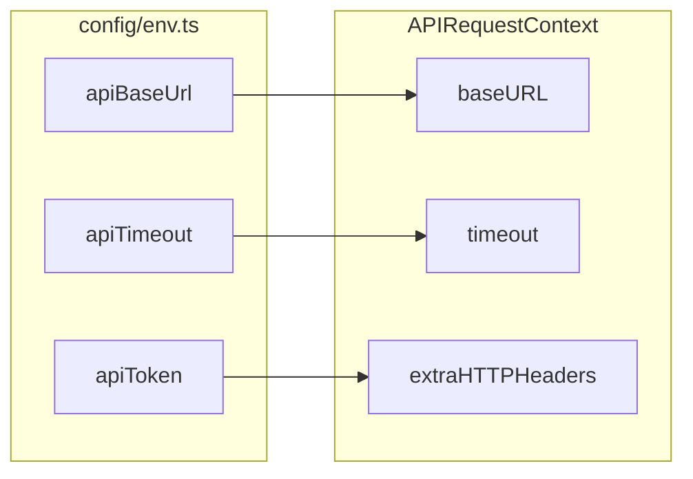

---

### Fase 3: Creación de Services

**Archivo**: `api/src/fixtures/api.fixture.ts`

**Cuándo**: Cuando el test solicita un service específico.

**Flujo de dependencias**:

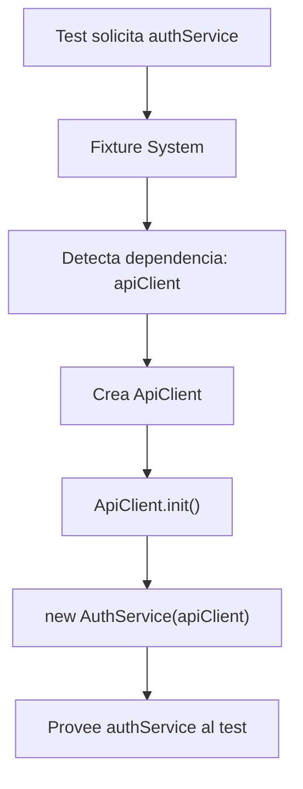

**Código del fixture**:

```typescript
authService: async ({ apiClient }, use) => {
  // apiClient ya está inicializado por su propio fixture
  await use(new AuthService(apiClient));
  // No hay teardown específico para el service
}
```

---

### Fase 4: Ejecución de Requests HTTP

**Archivos**: `api/src/services/*.ts` + `api/src/client/ApiClient.ts`

**Cuándo**: Durante la ejecución del test.

**Flujo de una petición POST**:

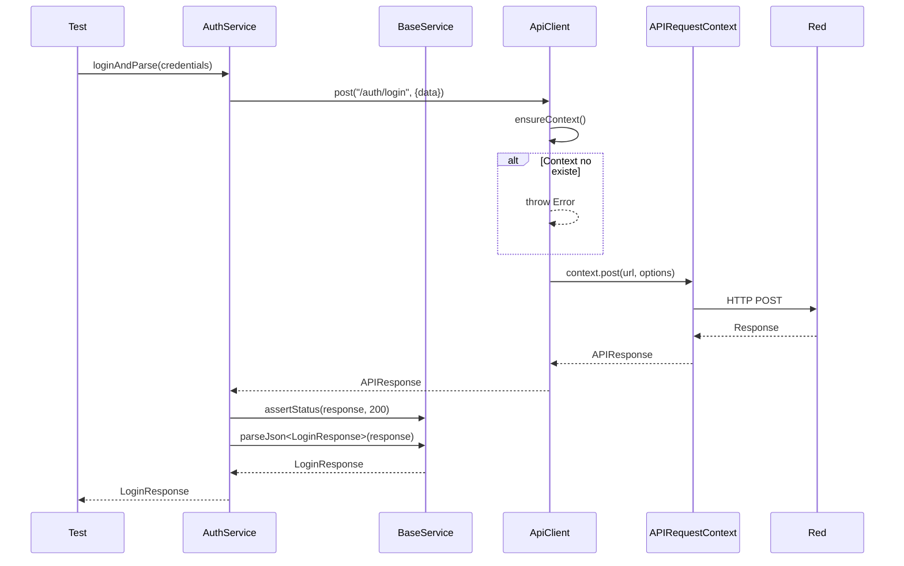

**Validación de contexto**:

```typescript
private ensureContext(): APIRequestContext {
  if (!this.context) {
    throw new Error("ApiClient not initialized. Call init() first.");
  }
  return this.context;
}
```

---

### Fase 5: Dispose del Cliente

**Archivo**: `api/src/client/ApiClient.ts`

**Cuándo**: Después de que el test termina (fixture teardown).

**Qué hace**:
1. Cierra todas las conexiones HTTP activas
2. Libera memoria del pool de conexiones
3. Marca el contexto como no disponible

```typescript
async dispose(): Promise<void> {
  await this.context?.dispose();
}
```

**Diagrama de recursos**:

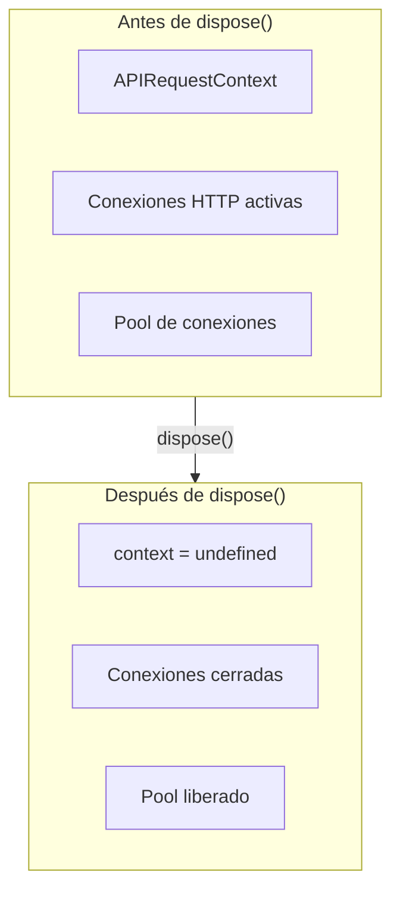

---

## Diagrama de Tiempo por Test

```mermaid
gantt
    title Ciclo de Vida del ApiClient
    dateFormat X
    axisFormat %s

    section Fixture Setup
    new ApiClient()          :a1, 0, 1
    ApiClient.init()         :a2, 1, 1

    section Service Setup
    new AuthService()        :b1, 2, 1

    section Test Execution
    loginAndParse()          :c1, 3, 2
    expect assertions        :c2, 5, 1

    section Fixture Teardown
    ApiClient.dispose()      :d1, 6, 1
```

## Comparación: Test Individual vs Múltiples Tests

### Test Individual

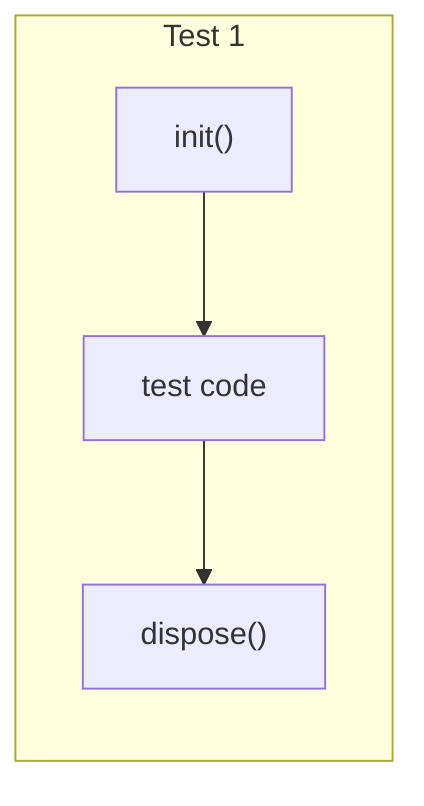

### Múltiples Tests (mismo describe)

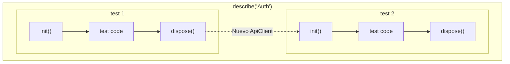

> **Nota**: Cada test obtiene su propia instancia de `ApiClient`. No hay estado compartido entre tests.

---

## Manejo de Errores

### Error: Cliente no inicializado

```mermaid
flowchart TB
    call["client.post()"]
    ensure["ensureContext()"]
    check{"this.context<br/>existe?"}
    error["throw Error<br/>'ApiClient not initialized'"]
    continue["Continuar request"]

    call --> ensure
    ensure --> check
    check -->|No| error
    check -->|Sí| continue
```

### Error: Request falla

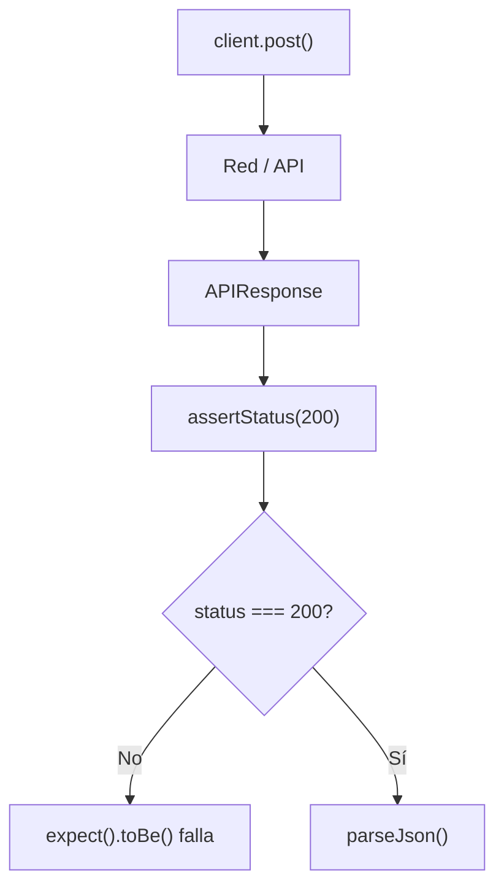

### Error: Timeout

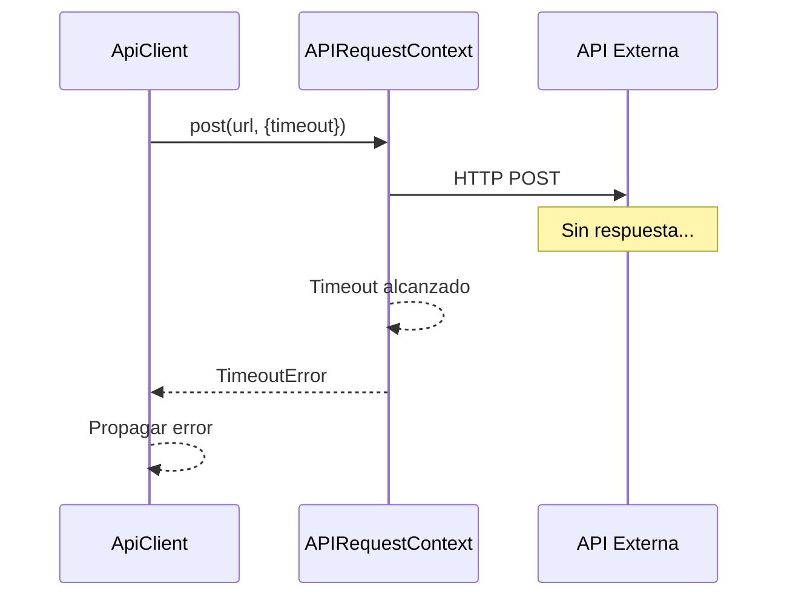

---

## Ciclo de Vida del APIRequestContext

El `APIRequestContext` de Playwright maneja internamente:

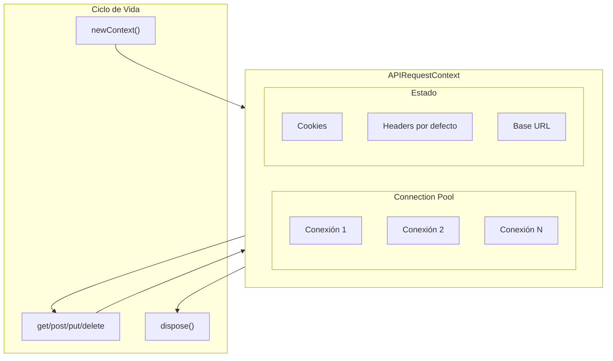

---

## Objetos y sus Ciclos de Vida

| Objeto | Creación | Destrucción | Alcance |
|--------|----------|-------------|---------|
| `ApiClient` | Fixture setup | Fixture teardown | Un test |
| `APIRequestContext` | `init()` | `dispose()` | Un test |
| `AuthService` | Fixture setup | - | Un test |
| `APIResponse` | Por request | GC | Un request |

---

## Configuración del Cliente

Variables de entorno que afectan el ciclo de vida:

| Variable | Efecto | Ejemplo |
|----------|--------|---------|
| `API_BASE_URL` | URL base para requests | `https://api.example.com` |
| `API_TIMEOUT` | Timeout en ms | `30000` |
| `API_TOKEN` | Token de autorización | `eyJhbG...` |

**Ejemplo de configuración**:

```env
# .env.qa
API_BASE_URL=https://api-qa.example.com
API_TIMEOUT=30000
API_TOKEN=your-qa-token
```

---

## Flujo Completo con Múltiples Requests

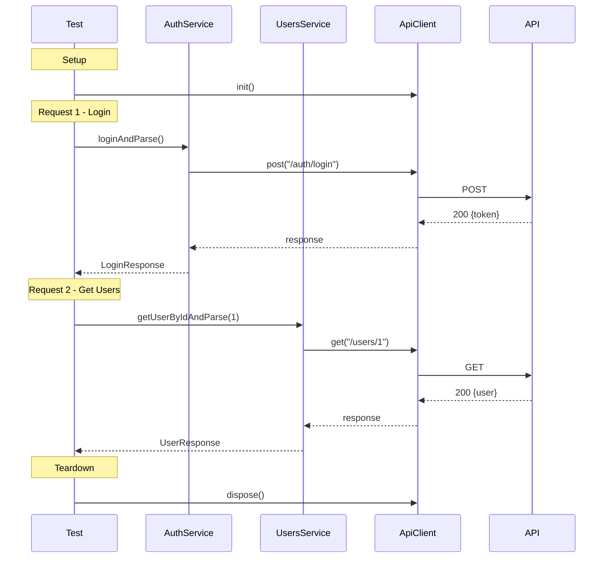

## Próximos Pasos

- [Capas del Módulo API](./capas-api.md) - Detalle de cada capa
- [Guía de Contribución](./guia-contribucion.md) - Cómo añadir services
- [Troubleshooting](./troubleshooting.md) - Problemas comunes
