# Ciclo de Vida del Driver - Módulo Front

Este documento detalla el ciclo de vida completo del browser/driver en el módulo Front, desde la inicialización hasta el cierre.

## Visión General

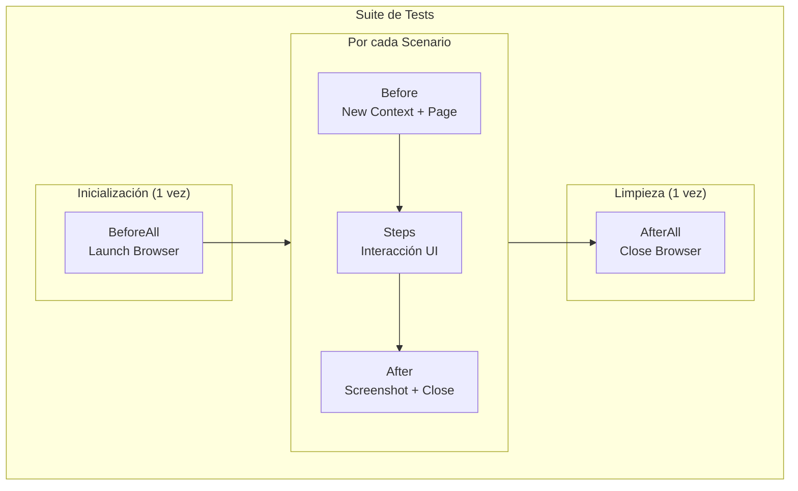

## Diagrama de Secuencia Completo

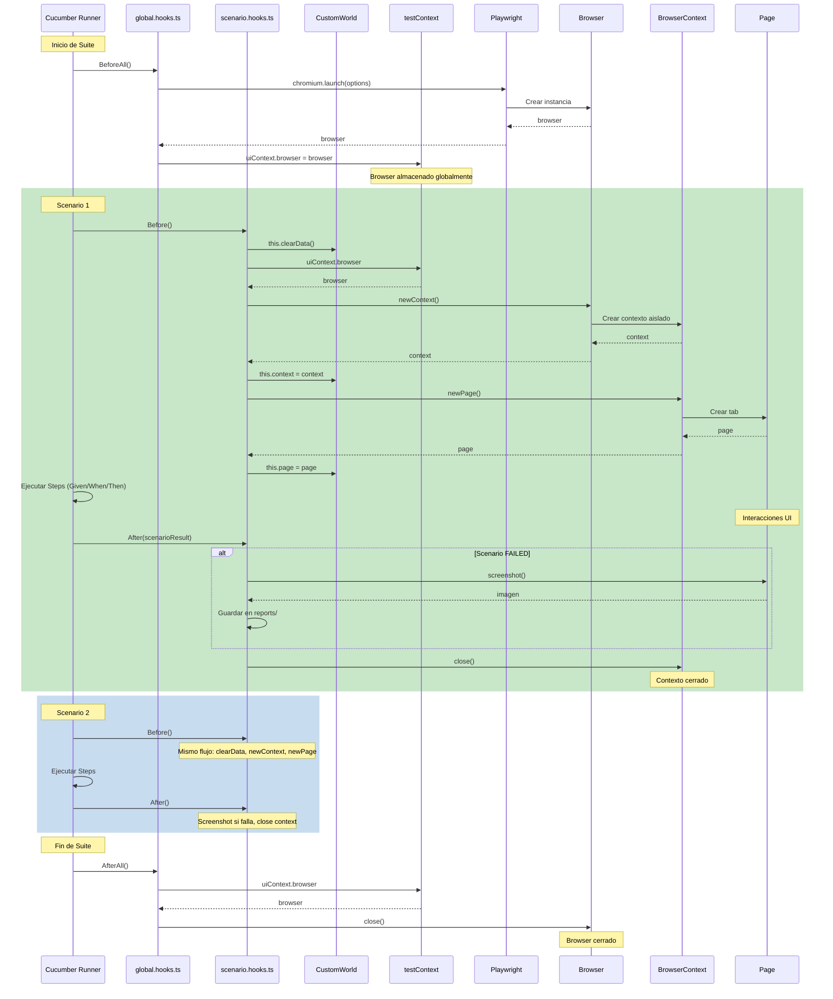

## Fases del Ciclo de Vida

### Fase 1: BeforeAll - Inicialización del Browser

**Archivo**: `front/src/hooks/global.hooks.ts`

**Cuándo**: Una vez al inicio de la suite, antes de cualquier scenario.

**Qué hace**:
1. Lee configuración de entorno (headless, slowMo)
2. Lanza instancia de Chromium
3. Almacena referencia en contexto global

```typescript
BeforeAll(async () => {
  uiContext.browser = await chromium.launch({
    headless: config.frontHeadless,  // true por defecto
    slowMo: config.frontSlowMoMs     // 0 por defecto
  });
});
```

**Diagrama de estado**:

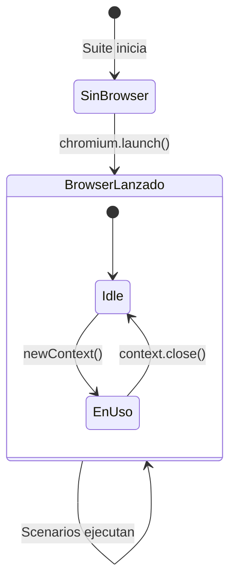

---

### Fase 2: Before - Setup del Scenario

**Archivo**: `front/src/hooks/scenario.hooks.ts`

**Cuándo**: Antes de cada scenario, después de parsear el feature.

**Qué hace**:
1. Valida que el browser existe
2. Limpia datos del scenario anterior
3. Crea nuevo `BrowserContext` (sesión aislada)
4. Crea nueva `Page` (tab del navegador)
5. Asigna referencias al World

```typescript
Before(async function (this: CustomWorld) {
  if (!uiContext.browser) {
    throw new Error("Browser is not initialized.");
  }

  this.clearData();  // Limpiar store de datos
  this.context = await uiContext.browser.newContext();
  this.page = await this.context.newPage();
});
```

**¿Por qué nuevo Context por scenario?**

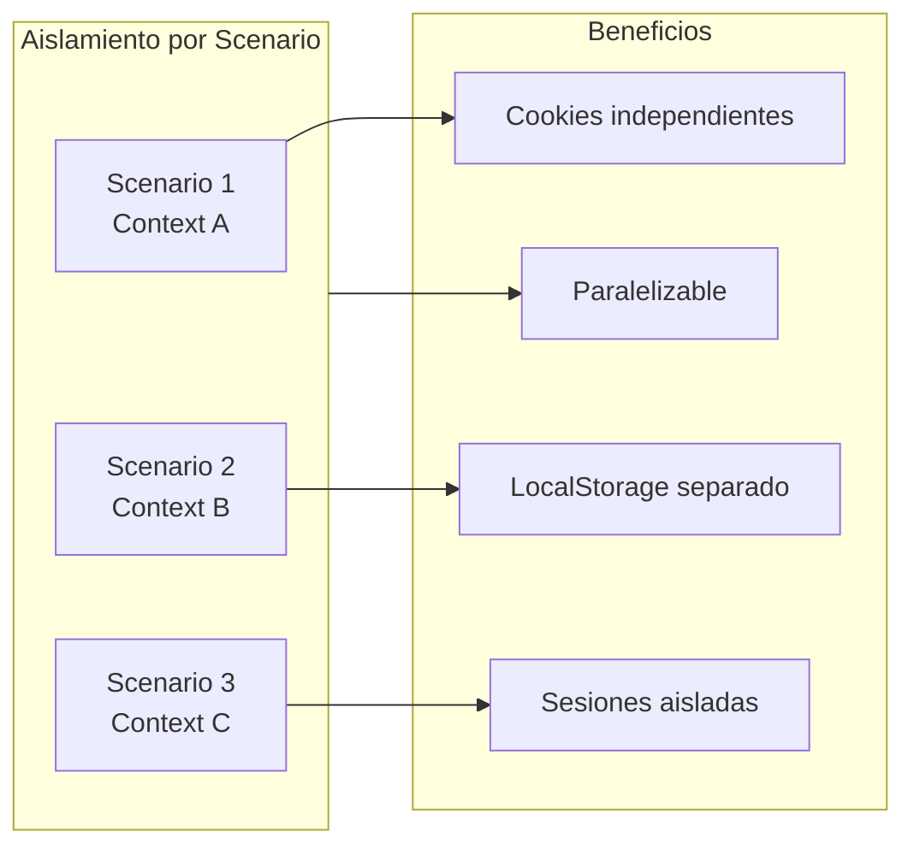

---

### Fase 3: Steps - Ejecución del Scenario

**Archivos**: `front/src/steps/*.ts` + `front/src/pages/*.ts`

**Cuándo**: Durante la ejecución de Given/When/Then.

**Flujo de interacción**:

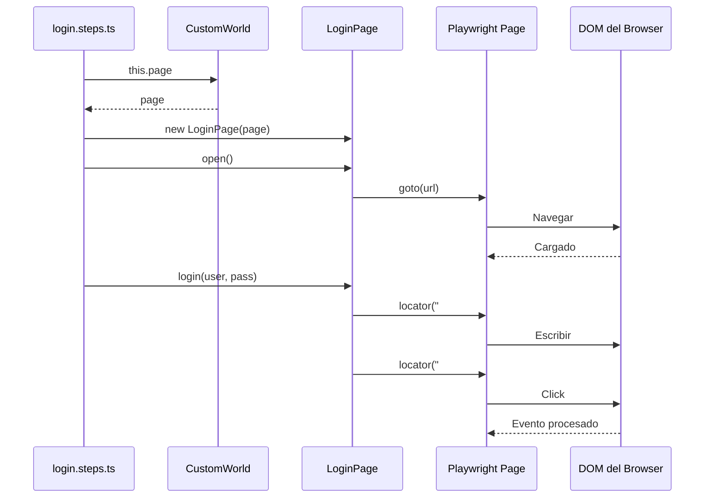

**Ciclo de vida de datos compartidos**:

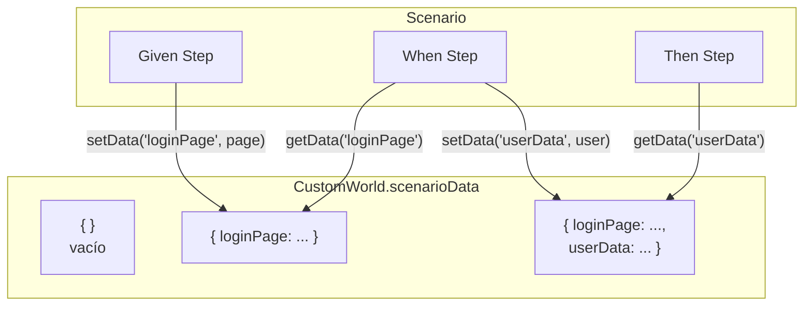

---

### Fase 4: After - Cleanup del Scenario

**Archivo**: `front/src/hooks/scenario.hooks.ts`

**Cuándo**: Después de cada scenario, incluso si falla.

**Qué hace**:
1. Verifica si el scenario falló
2. Si falló: captura screenshot de pantalla completa
3. Cierra el BrowserContext (y todas sus pages)

```typescript
After(async function (this: CustomWorld, scenario: ITestCaseHookParameter) {
  // Screenshot en fallo
  if (this.page && scenario.result?.status === Status.FAILED) {
    const reportDir = path.resolve(process.cwd(), "reports/front/screenshots");
    fs.mkdirSync(reportDir, { recursive: true });

    const fileName = `${scenario.pickle.name.replace(/\s+/g, "_")}-${Date.now()}.png`;
    await this.page.screenshot({
      path: path.join(reportDir, fileName),
      fullPage: true
    });
  }

  // Cerrar contexto
  await this.context?.close();
});
```

**Diagrama de decisión**:

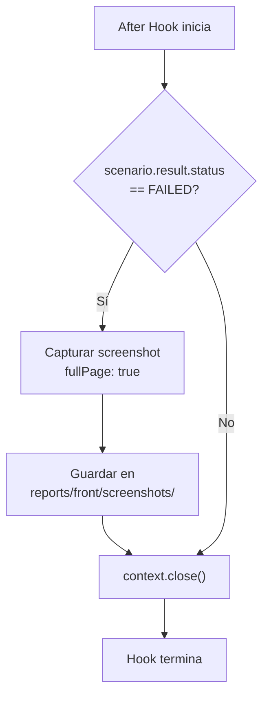

---

### Fase 5: AfterAll - Cierre del Browser

**Archivo**: `front/src/hooks/global.hooks.ts`

**Cuándo**: Una vez al final de la suite, después de todos los scenarios.

**Qué hace**:
1. Cierra la instancia del browser
2. Libera todos los recursos del proceso

```typescript
AfterAll(async () => {
  await uiContext.browser?.close();
});
```

**Estado final**:

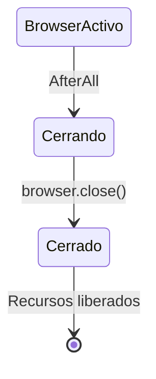

---

## Diagrama de Tiempo Completo

```mermaid
gantt
    title Ciclo de Vida del Browser
    dateFormat X
    axisFormat %s

    section Suite
    BeforeAll (launch)       :a1, 0, 1
    AfterAll (close)         :a2, 10, 1

    section Scenario 1
    Before (newContext)      :b1, 1, 1
    Given Step               :b2, 2, 1
    When Step                :b3, 3, 1
    Then Step                :b4, 4, 1
    After (close context)    :b5, 5, 1

    section Scenario 2
    Before (newContext)      :c1, 6, 1
    Steps                    :c2, 7, 2
    After (close context)    :c3, 9, 1
```

## Objetos y sus Ciclos de Vida

| Objeto | Creación | Destrucción | Alcance |
|--------|----------|-------------|---------|
| `Browser` | BeforeAll | AfterAll | Suite completa |
| `BrowserContext` | Before | After | Un scenario |
| `Page` | Before | After (implícito) | Un scenario |
| `CustomWorld` | Cucumber | Cucumber | Un scenario |
| `scenarioData` | Before (clear) | After (descartado) | Un scenario |

## Manejo de Errores

### Error: Browser no inicializado

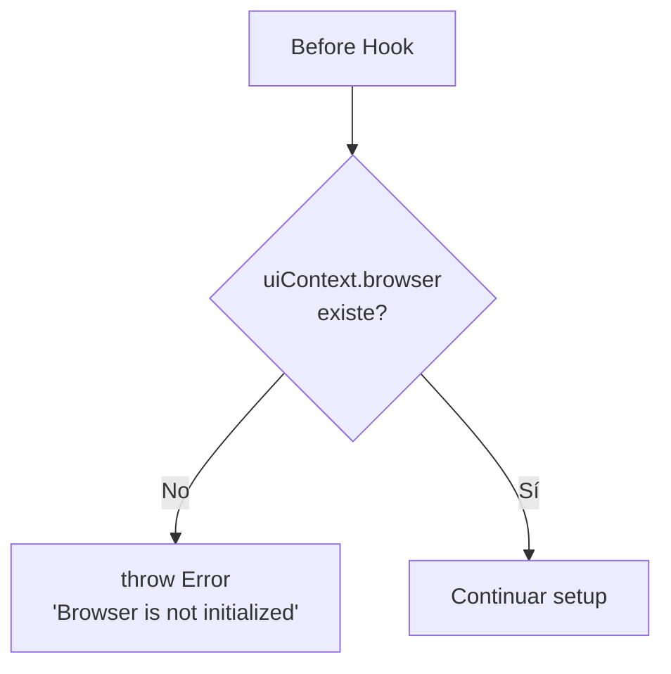

**Causas comunes**:
- BeforeAll no se ejecutó (error en import)
- Error previo en BeforeAll
- Orden incorrecto de hooks

### Error durante Step

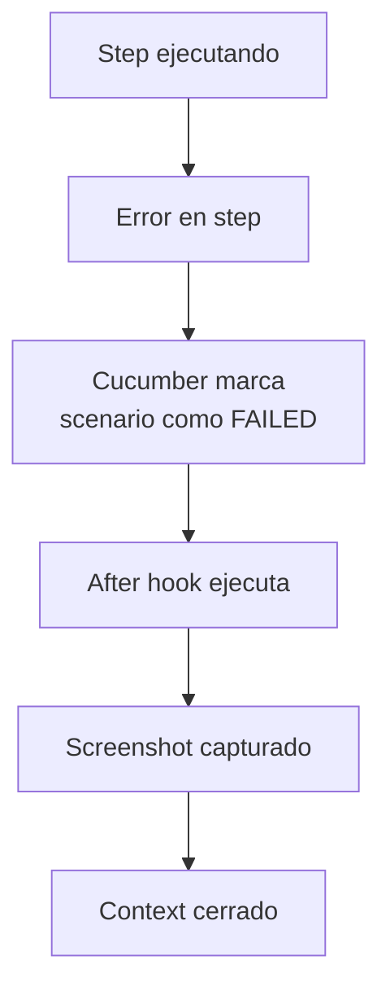

## Configuración del Browser

Variables de entorno que afectan el ciclo de vida:

| Variable | Efecto | Valor por defecto |
|----------|--------|-------------------|
| `FRONT_HEADLESS` | Browser visible/invisible | `true` |
| `FRONT_SLOWMO_MS` | Delay entre acciones (ms) | `0` |

**Para debugging visual**:

```env
# .env.local
FRONT_HEADLESS=false
FRONT_SLOWMO_MS=250
```

## Próximos Pasos

- [Capas del Módulo Front](./capas-front.md) - Detalle de cada capa
- [Guía de Contribución](./guia-contribucion.md) - Cómo añadir tests
- [Troubleshooting](./troubleshooting.md) - Problemas comunes
