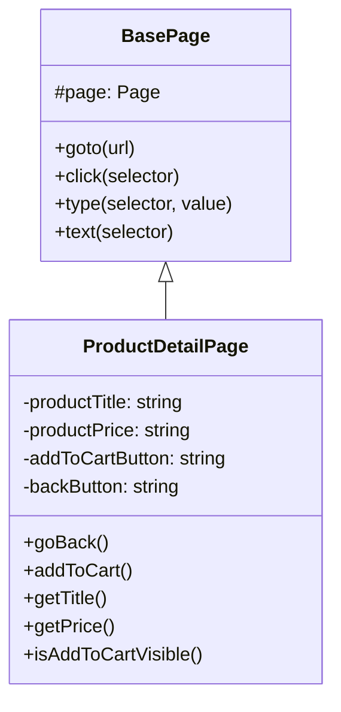
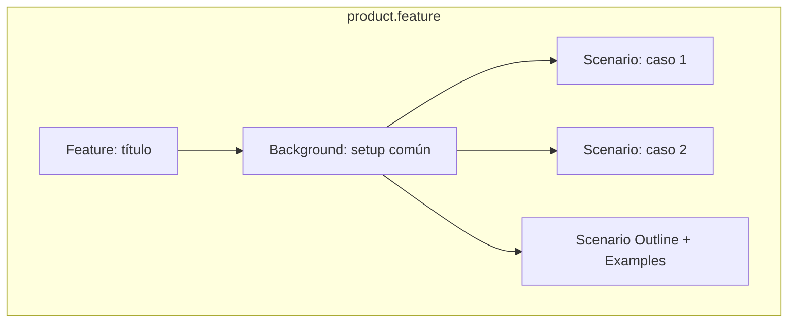
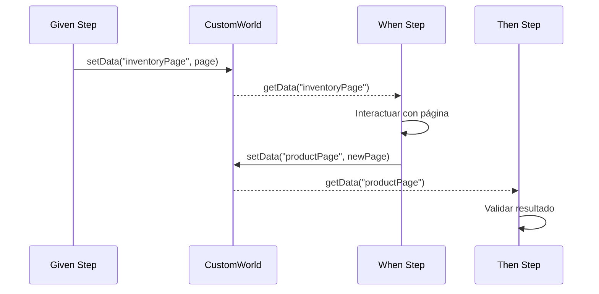
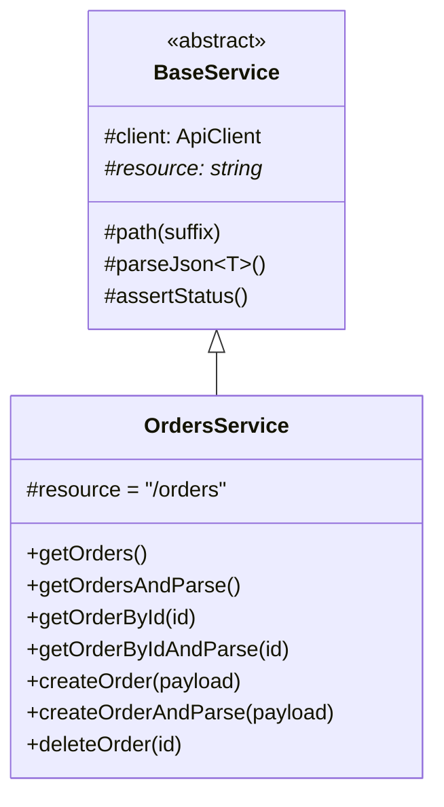

# Guía de Contribución

Esta guía explica cómo añadir nuevos componentes al framework: páginas, servicios, tests y features.

## Índice

- [Módulo Front](#módulo-front)
  - [Añadir una nueva Page](#añadir-una-nueva-page)
  - [Añadir un nuevo Feature](#añadir-un-nuevo-feature)
  - [Añadir nuevos Steps](#añadir-nuevos-steps)
- [Módulo API](#módulo-api)
  - [Añadir un nuevo Service](#añadir-un-nuevo-service)
  - [Añadir nuevos Models](#añadir-nuevos-models)
  - [Añadir un nuevo Test](#añadir-un-nuevo-test)
- [Configuración](#configuración)
  - [Añadir nueva variable de entorno](#añadir-nueva-variable-de-entorno)
- [Shared](#shared)
  - [Añadir utilidad compartida](#añadir-utilidad-compartida)

---

## Módulo Front

### Añadir una nueva Page

**Escenario**: Necesitas automatizar una nueva pantalla de la aplicación.

#### Paso 1: Crear el archivo de la Page

```typescript
// front/src/pages/ProductDetailPage.ts
import { BasePage } from "./BasePage";

export class ProductDetailPage extends BasePage {
  // 1. Definir selectores como propiedades privadas
  private readonly productTitle = "[data-test='product-title']";
  private readonly productPrice = "[data-test='product-price']";
  private readonly addToCartButton = "[data-test='add-to-cart']";
  private readonly backButton = "[data-test='back-to-products']";

  // 2. Métodos de navegación
  async goBack(): Promise<void> {
    await this.click(this.backButton);
  }

  // 3. Métodos de acción
  async addToCart(): Promise<void> {
    await this.click(this.addToCartButton);
  }

  // 4. Métodos de obtención de datos
  async getTitle(): Promise<string> {
    return this.text(this.productTitle);
  }

  async getPrice(): Promise<string> {
    return this.text(this.productPrice);
  }

  // 5. Métodos de validación (opcional)
  async isAddToCartVisible(): Promise<boolean> {
    return this.page.locator(this.addToCartButton).isVisible();
  }
}
```

#### Paso 2: Diagrama de la Page



#### Checklist

- [ ] Hereda de `BasePage`
- [ ] Selectores son propiedades `private readonly`
- [ ] Métodos tienen nombres descriptivos de negocio
- [ ] No expone selectores ni locators

---

### Añadir un nuevo Feature

**Escenario**: Necesitas definir nuevos casos de prueba en Gherkin.

#### Paso 1: Crear el archivo .feature

```gherkin
# front/src/features/product.feature
Feature: Gestión de productos
  Como usuario
  Quiero ver y agregar productos al carrito
  Para poder realizar compras

  Background:
    Given el usuario ha iniciado sesión

  Scenario: Ver detalle de un producto
    Given el usuario está en la página de inventario
    When hace clic en el nombre del primer producto
    Then debe ver la página de detalle del producto
    And debe ver el título del producto
    And debe ver el precio del producto

  Scenario: Agregar producto al carrito desde detalle
    Given el usuario está en la página de detalle de un producto
    When hace clic en "Add to cart"
    Then el botón debe cambiar a "Remove"
    And el contador del carrito debe mostrar "1"

  Scenario Outline: Agregar múltiples productos
    Given el usuario está en la página de inventario
    When agrega <cantidad> productos al carrito
    Then el contador del carrito debe mostrar "<cantidad>"

    Examples:
      | cantidad |
      | 1        |
      | 3        |
      | 6        |
```

#### Paso 2: Estructura recomendada



#### Checklist

- [ ] Feature tiene título descriptivo
- [ ] Background para setup repetitivo
- [ ] Scenarios independientes entre sí
- [ ] No hay detalles técnicos (selectores, URLs)
- [ ] Usa Scenario Outline para casos parametrizados

---

### Añadir nuevos Steps

**Escenario**: Necesitas implementar los steps de un nuevo feature.

#### Paso 1: Crear archivo de steps

```typescript
// front/src/steps/product.steps.ts
import { Given, When, Then } from "@cucumber/cucumber";
import { expect } from "@playwright/test";
import { CustomWorld } from "../support/world";
import { InventoryPage } from "../pages/InventoryPage";
import { ProductDetailPage } from "../pages/ProductDetailPage";

// Given steps
Given("el usuario está en la página de inventario", async function (this: CustomWorld) {
  const inventoryPage = new InventoryPage(this.page!);
  this.setData("inventoryPage", inventoryPage);
  // Asumiendo que ya navegó post-login
});

Given("el usuario está en la página de detalle de un producto", async function (this: CustomWorld) {
  const inventoryPage = new InventoryPage(this.page!);
  await inventoryPage.clickFirstProduct();

  const productPage = new ProductDetailPage(this.page!);
  this.setData("productPage", productPage);
});

// When steps
When("hace clic en el nombre del primer producto", async function (this: CustomWorld) {
  const inventoryPage = this.getData<InventoryPage>("inventoryPage")!;
  await inventoryPage.clickFirstProduct();

  // Guardar referencia a la nueva página
  const productPage = new ProductDetailPage(this.page!);
  this.setData("productPage", productPage);
});

When("hace clic en {string}", async function (this: CustomWorld, buttonText: string) {
  const productPage = this.getData<ProductDetailPage>("productPage")!;

  if (buttonText === "Add to cart") {
    await productPage.addToCart();
  }
  // Añadir más casos según necesidad
});

When("agrega {int} productos al carrito", async function (this: CustomWorld, cantidad: number) {
  const inventoryPage = this.getData<InventoryPage>("inventoryPage")!;

  for (let i = 0; i < cantidad; i++) {
    await inventoryPage.addItemToCart(i);
  }
});

// Then steps
Then("debe ver la página de detalle del producto", async function (this: CustomWorld) {
  const productPage = this.getData<ProductDetailPage>("productPage")!;
  const isVisible = await productPage.isAddToCartVisible();
  expect(isVisible).toBe(true);
});

Then("debe ver el título del producto", async function (this: CustomWorld) {
  const productPage = this.getData<ProductDetailPage>("productPage")!;
  const title = await productPage.getTitle();
  expect(title).toBeTruthy();
});

Then("el contador del carrito debe mostrar {string}", async function (this: CustomWorld, expected: string) {
  const inventoryPage = new InventoryPage(this.page!);
  const count = await inventoryPage.getCartCount();
  expect(count).toBe(expected);
});
```

#### Paso 2: Flujo de datos entre steps



#### Checklist

- [ ] Tipar `this: CustomWorld`
- [ ] Usar `setData()`/`getData()` para compartir estado
- [ ] Delegar interacciones a Page Objects
- [ ] No usar selectores directamente en steps
- [ ] Usar parámetros `{string}`, `{int}` para flexibilidad

---

## Módulo API

### Añadir un nuevo Service

**Escenario**: Necesitas interactuar con un nuevo dominio/recurso del API.

#### Paso 1: Crear el Service

```typescript
// api/src/services/OrdersService.ts
import { APIResponse } from "@playwright/test";
import { CreateOrderRequest } from "../models/requests/CreateOrderRequest";
import { OrderResponse, OrderListResponse } from "../models/responses/OrderResponse";
import { BaseService } from "./BaseService";

export class OrdersService extends BaseService {
  protected readonly resource = "/orders";

  // GET /orders
  async getOrders(): Promise<APIResponse> {
    return this.client.get(this.path());
  }

  async getOrdersAndParse(): Promise<OrderListResponse> {
    const response = await this.getOrders();
    this.assertStatus(response, 200);
    return this.parseJson<OrderListResponse>(response);
  }

  // GET /orders/:id
  async getOrderById(id: number): Promise<APIResponse> {
    return this.client.get(this.path(`/${id}`));
  }

  async getOrderByIdAndParse(id: number): Promise<OrderResponse> {
    const response = await this.getOrderById(id);
    this.assertStatus(response, 200);
    return this.parseJson<OrderResponse>(response);
  }

  // POST /orders
  async createOrder(payload: CreateOrderRequest): Promise<APIResponse> {
    return this.client.post(this.path(), { data: payload });
  }

  async createOrderAndParse(payload: CreateOrderRequest): Promise<OrderResponse> {
    const response = await this.createOrder(payload);
    this.assertStatus(response, 201);
    return this.parseJson<OrderResponse>(response);
  }

  // DELETE /orders/:id
  async deleteOrder(id: number): Promise<APIResponse> {
    return this.client.delete(this.path(`/${id}`));
  }
}
```

#### Paso 2: Registrar en Fixture

```typescript
// api/src/fixtures/api.fixture.ts
import { test as base } from "@playwright/test";
import { ApiClient } from "../client/ApiClient";
import { AuthService } from "../services/AuthService";
import { UsersService } from "../services/UsersService";
import { OrdersService } from "../services/OrdersService"; // Nuevo
import "../hooks/api.hooks";

type ApiFixtures = {
  apiClient: ApiClient;
  authService: AuthService;
  usersService: UsersService;
  ordersService: OrdersService; // Nuevo
};

export const test = base.extend<ApiFixtures>({
  apiClient: async ({}, use) => {
    const client = new ApiClient();
    await client.init();
    await use(client);
    await client.dispose();
  },
  authService: async ({ apiClient }, use) => {
    await use(new AuthService(apiClient));
  },
  usersService: async ({ apiClient }, use) => {
    await use(new UsersService(apiClient));
  },
  // Nuevo fixture
  ordersService: async ({ apiClient }, use) => {
    await use(new OrdersService(apiClient));
  }
});

export { expect } from "@playwright/test";
```

#### Paso 3: Diagrama del Service



#### Checklist

- [ ] Hereda de `BaseService`
- [ ] Define `resource` como constante
- [ ] Métodos raw retornan `APIResponse`
- [ ] Métodos `*AndParse` validan status y parsean
- [ ] Registrado en `api.fixture.ts`

---

### Añadir nuevos Models

**Escenario**: Necesitas definir tipos para request/response de un endpoint.

#### Request Model

```typescript
// api/src/models/requests/CreateOrderRequest.ts
export interface OrderItem {
  productId: number;
  quantity: number;
}

export interface CreateOrderRequest {
  customerId: number;
  items: OrderItem[];
  shippingAddress: string;
  paymentMethod: "credit_card" | "paypal" | "bank_transfer";
}
```

#### Response Model

```typescript
// api/src/models/responses/OrderResponse.ts
export interface OrderItem {
  productId: number;
  productName: string;
  quantity: number;
  unitPrice: number;
  total: number;
}

export interface OrderResponse {
  id: number;
  customerId: number;
  items: OrderItem[];
  subtotal: number;
  tax: number;
  total: number;
  status: "pending" | "processing" | "shipped" | "delivered";
  createdAt: string;
  updatedAt: string;
}

export interface OrderListResponse {
  orders: OrderResponse[];
  total: number;
  page: number;
  pageSize: number;
}
```

#### Checklist

- [ ] Interfaces (no clases) para data shapes
- [ ] Tipos literales para valores fijos
- [ ] Ubicación correcta: `requests/` o `responses/`

---

### Añadir un nuevo Test

**Escenario**: Necesitas escribir tests para el nuevo service.

#### Crear archivo de test

```typescript
// api/src/tests/orders.spec.ts
import { expect, test } from "../fixtures/api.fixture";

test.describe("Orders service", () => {

  test.describe("GET /orders", () => {
    test("should return list of orders", async ({ ordersService }) => {
      const orders = await ordersService.getOrdersAndParse();

      expect(orders.orders).toBeInstanceOf(Array);
      expect(orders.total).toBeGreaterThanOrEqual(0);
    });
  });

  test.describe("GET /orders/:id", () => {
    test("should return order by id", async ({ ordersService }) => {
      // Arrange
      const orderId = 1;

      // Act
      const order = await ordersService.getOrderByIdAndParse(orderId);

      // Assert
      expect(order.id).toBe(orderId);
      expect(order.items).toBeDefined();
    });

    test("should return 404 for non-existent order", async ({ ordersService }) => {
      const response = await ordersService.getOrderById(999999);

      expect(response.status()).toBe(404);
    });
  });

  test.describe("POST /orders", () => {
    test("should create new order", async ({ ordersService }) => {
      // Arrange
      const newOrder = {
        customerId: 1,
        items: [{ productId: 1, quantity: 2 }],
        shippingAddress: "123 Test St",
        paymentMethod: "credit_card" as const
      };

      // Act
      const created = await ordersService.createOrderAndParse(newOrder);

      // Assert
      expect(created.id).toBeTruthy();
      expect(created.status).toBe("pending");
      expect(created.items).toHaveLength(1);
    });

    test("should fail with invalid payload", async ({ ordersService }) => {
      const invalidOrder = {
        customerId: -1,
        items: [],
        shippingAddress: "",
        paymentMethod: "invalid" as any
      };

      const response = await ordersService.createOrder(invalidOrder);

      expect([400, 422]).toContain(response.status());
    });
  });

});
```

#### Checklist

- [ ] Importar `test` y `expect` desde fixture
- [ ] Agrupar con `describe` por endpoint/comportamiento
- [ ] Patrón AAA: Arrange, Act, Assert
- [ ] Cubrir happy path y error cases
- [ ] No hardcodear datos sensibles

---

## Configuración

### Añadir nueva variable de entorno

#### Paso 1: Definir en types

```typescript
// config/types.ts
export type TestEnv = "local" | "qa" | "prod";

export interface AppConfig {
  env: TestEnv;
  frontBaseUrl: string;
  frontUsername: string;
  frontPassword: string;
  frontHeadless: boolean;
  frontSlowMoMs: number;
  apiBaseUrl: string;
  apiTimeout: number;
  apiToken?: string;
  e2eUsername: string;
  e2ePassword: string;
  // Nueva variable
  featureFlagEnabled: boolean;
}
```

#### Paso 2: Cargar en env.ts

```typescript
// config/env.ts
function loadConfig(): AppConfig {
  // ... código existente ...

  return {
    // ... campos existentes ...

    // Nueva variable
    featureFlagEnabled: parseBoolean(optional("FEATURE_FLAG_ENABLED", "false"))
  };
}
```

#### Paso 3: Añadir a archivos .env

```env
# .env
FEATURE_FLAG_ENABLED=false

# .env.qa
FEATURE_FLAG_ENABLED=true

# .env.prod
FEATURE_FLAG_ENABLED=true
```

#### Checklist

- [ ] Tipo definido en `types.ts`
- [ ] Cargado en `env.ts` (required u optional)
- [ ] Valor por defecto si es optional
- [ ] Presente en todos los `.env.*`

---

## Shared

### Añadir utilidad compartida

**Escenario**: Necesitas una función reutilizable en ambos módulos.

#### Crear la utilidad

```typescript
// shared/utils/randomData.ts
export function randomEmail(): string {
  const timestamp = Date.now();
  const random = Math.random().toString(36).substring(7);
  return `test_${timestamp}_${random}@example.com`;
}

export function randomString(length: number): string {
  const chars = "abcdefghijklmnopqrstuvwxyz";
  let result = "";
  for (let i = 0; i < length; i++) {
    result += chars.charAt(Math.floor(Math.random() * chars.length));
  }
  return result;
}

export function randomInt(min: number, max: number): number {
  return Math.floor(Math.random() * (max - min + 1)) + min;
}
```

#### Usar en módulos

```typescript
// api/src/tests/users.spec.ts
import { randomEmail } from "../../../shared/utils/randomData";

test("should create user with random email", async ({ usersService }) => {
  const email = randomEmail();
  // ...
});
```

```typescript
// front/src/steps/registration.steps.ts
import { randomEmail } from "../../../shared/utils/randomData";

When("el usuario completa el formulario con datos aleatorios", async function () {
  const email = randomEmail();
  // ...
});
```

---

## Resumen de Rutas

| Componente | Módulo | Ruta |
|------------|--------|------|
| Page | Front | `front/src/pages/` |
| Feature | Front | `front/src/features/` |
| Steps | Front | `front/src/steps/` |
| Service | API | `api/src/services/` |
| Request Model | API | `api/src/models/requests/` |
| Response Model | API | `api/src/models/responses/` |
| Test | API | `api/src/tests/` |
| Fixture | API | `api/src/fixtures/` |
| Config Type | Shared | `config/types.ts` |
| Utility | Shared | `shared/utils/` |
