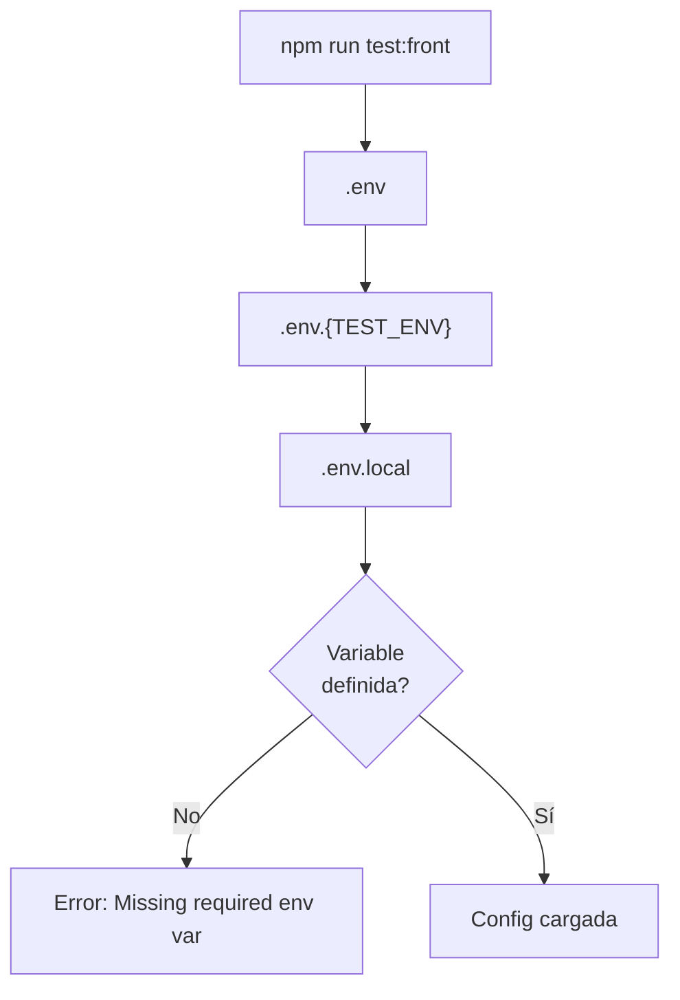
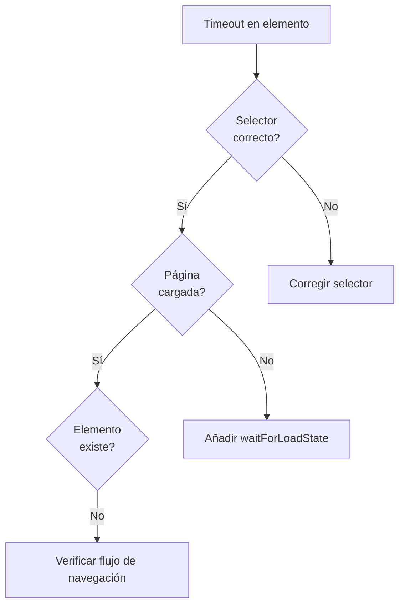
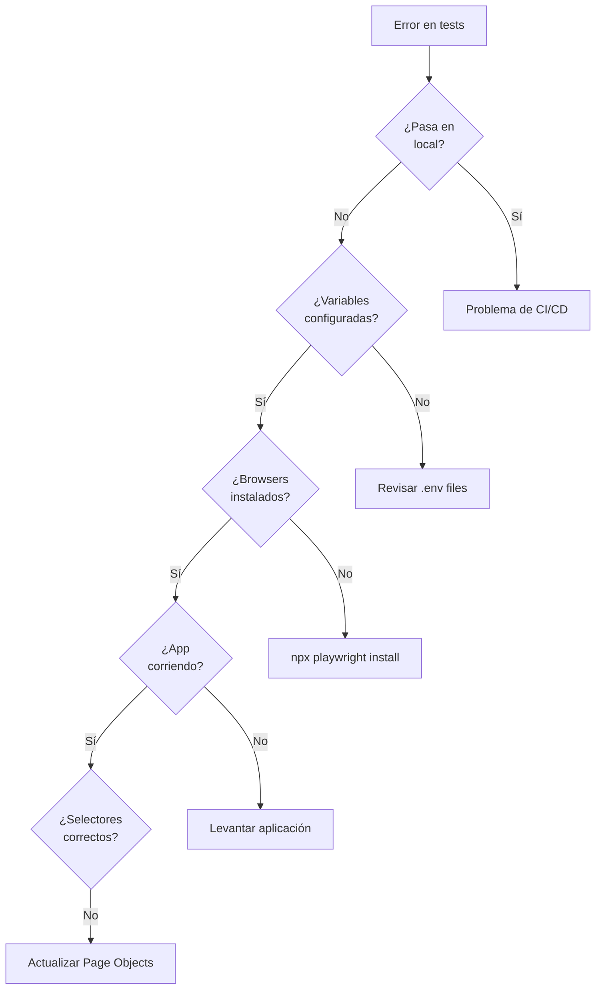

# Troubleshooting

Guía de problemas comunes y sus soluciones para el framework de automatización.

## Índice

- [Errores de Configuración](#errores-de-configuración)
- [Errores del Módulo Front](#errores-del-módulo-front)
- [Errores del Módulo API](#errores-del-módulo-api)
- [Errores de Playwright](#errores-de-playwright)
- [Errores de Cucumber](#errores-de-cucumber)
- [Errores de TypeScript](#errores-de-typescript)

---

## Errores de Configuración

### Error: Missing required env var

```
Error: Missing required env var: FRONT_BASE_URL
```

**Causa**: Variable de entorno obligatoria no definida.

**Solución**:

1. Verificar que existe el archivo `.env` correspondiente:
   ```bash
   ls -la .env*
   ```

2. Verificar que la variable está definida:
   ```bash
   grep FRONT_BASE_URL .env
   grep FRONT_BASE_URL .env.local
   ```

3. Crear/actualizar el archivo `.env.local`:
   ```env
   FRONT_BASE_URL=https://www.saucedemo.com
   ```

**Diagrama de carga de variables**:



---

### Error: Invalid TEST_ENV

```
Error: Invalid TEST_ENV: staging. Valid values are: local, qa, prod
```

**Causa**: Valor de `TEST_ENV` no es válido.

**Solución**:

```bash
# Correcto
cross-env TEST_ENV=local npm run test:front
cross-env TEST_ENV=qa npm run test:front
cross-env TEST_ENV=prod npm run test:front

# Incorrecto
cross-env TEST_ENV=staging npm run test:front  # No existe
cross-env TEST_ENV=LOCAL npm run test:front    # Case sensitive
```

---

## Errores del Módulo Front

### Error: Browser is not initialized

```
Error: Browser is not initialized. Ensure BeforeAll hook has run.
```

**Causa**: El hook `BeforeAll` no se ejecutó antes del scenario.

**Posibles razones**:

1. **Error en import de hooks**:
   ```javascript
   // cucumber.js - Verificar que los hooks están incluidos
   require: [
     "front/src/hooks/global.hooks.ts",  // ¿Existe?
     "front/src/hooks/scenario.hooks.ts"
   ]
   ```

2. **Error previo en BeforeAll**:
   - Revisar logs para errores en `chromium.launch()`
   - Verificar que Playwright está instalado: `npx playwright install`

3. **Orden incorrecto de hooks**:
   ```mermaid
   flowchart LR
       global["global.hooks.ts<br/>(BeforeAll)"]
       scenario["scenario.hooks.ts<br/>(Before)"]

       global -->|"Debe ejecutar primero"| scenario
   ```

**Solución**:

```bash
# Reinstalar browsers de Playwright
npx playwright install

# Verificar configuración de Cucumber
cat front/cucumber.js
```

---

### Error: Cannot read property 'page' of undefined

```
TypeError: Cannot read properties of undefined (reading 'page')
```

**Causa**: `this.page` es `undefined` en un step.

**Posibles razones**:

1. **Falta tipar `this`**:
   ```typescript
   // Incorrecto
   Given("...", async function () {
     this.page.goto(...);  // this no está tipado
   });

   // Correcto
   Given("...", async function (this: CustomWorld) {
     this.page!.goto(...);
   });
   ```

2. **Before hook no se ejecutó**:
   - El `Before` hook es el que asigna `this.page`
   - Verificar que `scenario.hooks.ts` está en `require` de `cucumber.js`

---

### Error: Timeout waiting for element

```
TimeoutError: Timeout 30000ms exceeded waiting for locator('#elemento')
```

**Causa**: El elemento no aparece en el tiempo esperado.

**Soluciones**:

1. **Verificar selector**:
   ```typescript
   // Abrir en modo visible para debugging
   // .env.local
   FRONT_HEADLESS=false
   FRONT_SLOWMO_MS=500
   ```

2. **Añadir espera explícita**:
   ```typescript
   // En el Page Object
   async waitForElement(): Promise<void> {
     await this.page.locator("#elemento").waitFor({ state: "visible" });
   }
   ```

3. **Verificar que la página cargó**:
   ```typescript
   await this.page.waitForLoadState("networkidle");
   ```

**Diagrama de diagnóstico**:



---

### Error: Screenshot en directorio inexistente

```
Error: ENOENT: no such file or directory, open 'reports/front/screenshots/...'
```

**Causa**: El directorio de screenshots no existe.

**Solución**: El hook ya crea el directorio, pero si falla:

```bash
# Crear manualmente
mkdir -p reports/front/screenshots

# O limpiar y reiniciar
npm run clean
```

---

## Errores del Módulo API

### Error: ApiClient not initialized

```
Error: ApiClient not initialized. Call init() first.
```

**Causa**: Se intentó usar el cliente antes de inicializarlo.

**Posibles razones**:

1. **Fixture no configurada correctamente**:
   ```typescript
   // Verificar api.fixture.ts
   apiClient: async ({}, use) => {
     const client = new ApiClient();
     await client.init();      // ¿Se llama init()?
     await use(client);
     await client.dispose();
   }
   ```

2. **Importación incorrecta en test**:
   ```typescript
   // Incorrecto
   import { test } from "@playwright/test";

   // Correcto
   import { test } from "../fixtures/api.fixture";
   ```

---

### Error: Expected status X but got Y

```
Error: Expected status 200 but got 401
```

**Causa**: El API retorna un status diferente al esperado.

**Soluciones**:

1. **Verificar credenciales**:
   ```bash
   # Revisar variables de entorno
   grep E2E_USERNAME .env.local
   grep E2E_PASSWORD .env.local
   ```

2. **Verificar token**:
   ```typescript
   // Si el endpoint requiere autenticación
   // Verificar que API_TOKEN está configurado
   ```

3. **Usar método raw para debugging**:
   ```typescript
   // En lugar de loginAndParse(), usar login()
   const response = await authService.login(credentials);
   console.log("Status:", response.status());
   console.log("Body:", await response.json());
   ```

---

### Error: Request timeout

```
TimeoutError: Request timed out after 30000ms
```

**Causa**: El API no responde en el tiempo configurado.

**Soluciones**:

1. **Aumentar timeout**:
   ```env
   # .env.local
   API_TIMEOUT=60000
   ```

2. **Verificar conectividad**:
   ```bash
   curl -v $API_BASE_URL/health
   ```

3. **Verificar que el servidor está corriendo**

---

### Error: JSON parse error

```
SyntaxError: Unexpected token '<' in JSON at position 0
```

**Causa**: El API retorna HTML (posiblemente página de error) en lugar de JSON.

**Diagnóstico**:

```typescript
const response = await authService.login(credentials);
const text = await response.text();  // Ver respuesta raw
console.log(text);
```

**Posibles causas**:
- URL incorrecta (404 con página HTML)
- Error del servidor (500 con página de error)
- Redirección a página de login

---

## Errores de Playwright

### Error: browserType.launch: Executable doesn't exist

```
browserType.launch: Executable doesn't exist at /path/to/chromium
```

**Causa**: Los browsers de Playwright no están instalados.

**Solución**:

```bash
npx playwright install
```

---

### Error: net::ERR_CONNECTION_REFUSED

```
page.goto: net::ERR_CONNECTION_REFUSED at https://localhost:3000
```

**Causa**: La aplicación no está corriendo en la URL configurada.

**Soluciones**:

1. **Verificar que la app está corriendo**
2. **Verificar URL en configuración**:
   ```bash
   grep FRONT_BASE_URL .env.local
   ```

---

## Errores de Cucumber

### Error: Undefined step

```
? Given el usuario está en la página principal
    Undefined. Implement with the following snippet:

    Given('el usuario está en la página principal', function () {
      return 'pending';
    });
```

**Causa**: El step no tiene implementación.

**Solución**: Implementar el step en `front/src/steps/`:

```typescript
Given("el usuario está en la página principal", async function (this: CustomWorld) {
  // Implementación
});
```

---

### Error: Ambiguous step

```
Multiple step definitions match:
  Given('el usuario {string}', ...)
  Given('el usuario está logueado', ...)
```

**Causa**: Dos definiciones de step coinciden con el mismo texto.

**Solución**: Hacer los steps más específicos:

```typescript
// Evitar
Given("el usuario {string}", ...);

// Preferir
Given("el usuario con nombre {string}", ...);
Given("el usuario está logueado", ...);
```

---

### Error: No specs found

```
No specs found
Pattern: front/src/features/**/*.feature
```

**Causa**: No se encuentran archivos `.feature`.

**Verificar**:

```bash
# ¿Existen los archivos?
ls front/src/features/

# ¿El path en cucumber.js es correcto?
cat front/cucumber.js | grep paths
```

---

## Errores de TypeScript

### Error: Cannot find module

```
Error: Cannot find module '../../../config'
```

**Causa**: Path de importación incorrecto.

**Solución**: Verificar la ruta relativa desde el archivo actual:

```
api/src/tests/auth.spec.ts
    │   │    │
    │   │    └── Desde aquí
    │   └── src
    └── api

Para llegar a config/ necesitas: ../../../config
```

---

### Error: Property does not exist on type

```
Property 'newMethod' does not exist on type 'BasePage'
```

**Causa**: Intentando usar un método que no existe en la clase.

**Soluciones**:

1. **Verificar que el método existe en la clase**
2. **Verificar que importas la clase correcta**
3. **Si es método nuevo, añadirlo a la clase**

---

## Comandos de Diagnóstico

```bash
# Verificar instalación de Playwright
npx playwright --version

# Reinstalar browsers
npx playwright install --force

# Verificar configuración de TypeScript
npx tsc --noEmit

# Ejecutar un solo test para debugging
cross-env TEST_ENV=local cucumber-js --config front/cucumber.js --name "Login exitoso"

# Ver logs detallados de Playwright
DEBUG=pw:api npm run test:front
```

---

## Checklist de Diagnóstico General


